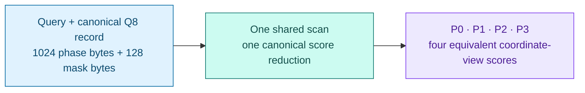
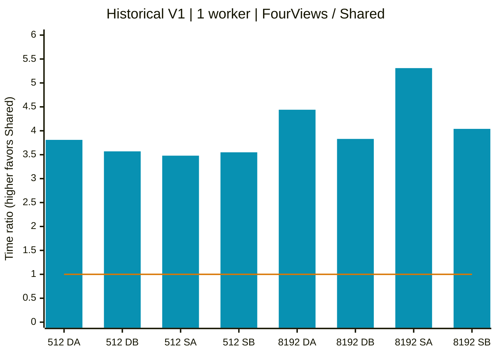
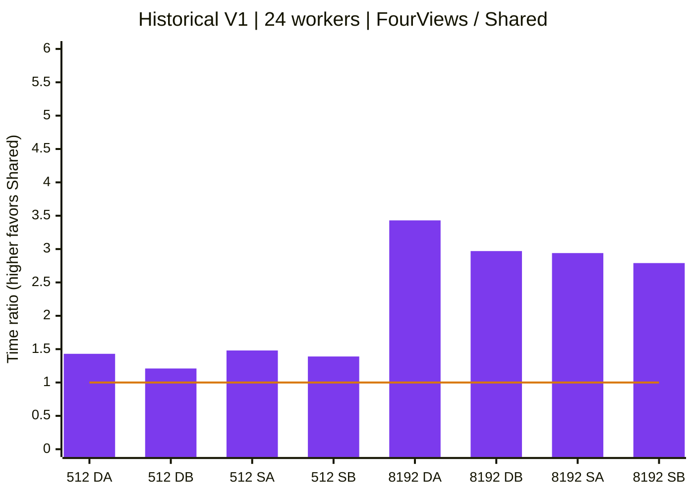
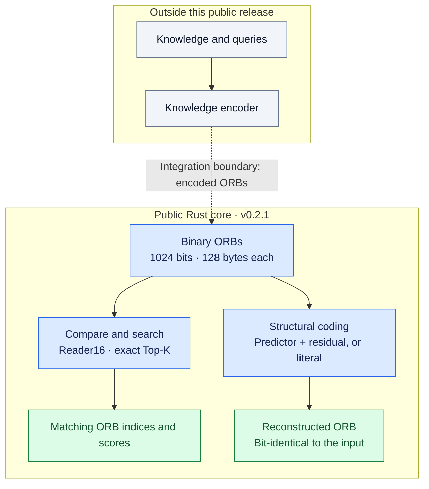
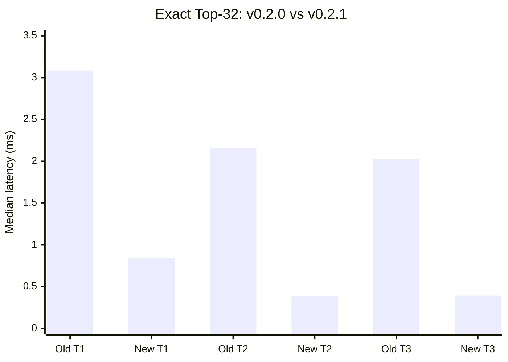

# GEL RAM

## Local Q8 evidence candidate — not a tagged release

[Revision2 audit](docs/Q8-CANDIDATE-R2-AUDIT.md): hardened fixture inputs,
145 passing test executions per profile and a complete repeat campaign.

[New numeric sample and current results](docs/Q8-EVIDENCE-CANDIDATE.md):
checked view descriptors, a canonical single-read baseline, the complete V2
timing matrix and a separate check on real encoded phase/mask records.
Four views remain four interpretations of one carrier, not independent facts.

```text
cargo run --locked --offline --release -p gel-phase-quad --example quad_evidence -- --demo
```

This **synthetic 32-record demo** needs no private bank or model. Expected:
`Q8_EVIDENCE=PASS`. Real-input tests passed all numerical comparisons, but
Shared is not universally faster than a canonical single reader. See the
[complete table, including slowdowns](docs/Q8-EVIDENCE-CANDIDATE.md).

The earlier public documentation and historical measurements follow.

A Rust memory core for an AI knowledge bank. Explore exact binary readout and
an experimental Q8 Quad reader: **four equivalent views, one stored record**.
This public preview is not a complete AI model.

[Start with the evidence](docs/VERIFIED-RESULTS.md) ·
[Run the demos](#quick-start) ·
[Reproduce on your CPU](https://github.com/Gelram-project/gel-ram/issues/new?template=reproduction.yml)

> Binary-core hardening: scheduling, raw rotation bounds,
> canonical residual validation and benchmark failure gates.
> [Scope and reproduction](docs/BINARY-GATE-HARDENING.md).
> This does not replace the historical Q8 timing campaign or the v0.2.1 tag.

> Unreleased Q8 Quad preview built on v0.2.1. The new phase reader
> uses the same PolyForm Noncommercial 1.0.0 license as this public tree.
> This preview is not part of the existing v0.2.1 release tag.

## Q8 Quad Grid — four views, one stored record

**Four equivalent Q8 coordinate views without four copies of the data.**

The experimental [Q8 Quad module](docs/Q8-QUAD.md) stores one 1024-dimensional
phase record with an explicit activity mask. The shared reader keeps the same
canonical record payload as a single Q8 record: **1024 phase bytes + 128 mask
bytes = 1152 bytes**. Runtime tables, query preparation and output buffers are
additional; this is not a claim of unchanged total process RAM.

**“4×” means four equivalent views of the same content, not four independent
memories, four confidence votes or a guaranteed 4× speedup.** Q8 means 256 phase
levels here, not a 256-byte record or LLM model weights. Four reversible
coordinate views share one score when the same transformation is applied to
both sides. This removes repeated work, not uncertainty about knowledge.



Matching reversible transforms are applied to both query and candidate.
This diagram describes equivalent readouts, not four independent facts or a
physical analog-wave circuit.

| Record payload | One canonical Q8 record | Shared Q8 Quad | Four packed copies |
| :--- | ---: | ---: | ---: |
| Phase data | 1024 bytes | 1024 bytes | 4096 bytes |
| Activity mask | 128 bytes | 128 bytes | 512 bytes |
| Total record material | 1152 bytes | 1152 bytes | 4608 bytes |

Packed material is not process RAM: the measured reference uses 8192 bytes
for four frames with boolean masks, and the benchmark holds both banks.
The shared path performs one score reduction per query–record pair instead of
the four reference reductions. All **8,355,840 / 8,355,840 view-score comparisons**
in the historical V1 campaign passed. These are correlated synthetic checks,
not a measurement of semantic retrieval accuracy.

```text
cargo run --locked --offline --release -p gel-phase-quad --example quad_compare -- --orbs 8192 --rounds 9 --workers 1 --sparse 1 --policy active
```

This synthetic demo compares a materialized reference single view, four
materialized views and the shared scan. Every score is checked outside the
timer; all timing samples are printed. No private bank, text encoder or model
is needed. A Q8 record is **1152 bytes including its mask, not a 128-byte ORB**.
Four views are not four independent pieces of evidence. There is no new
semantic-accuracy claim and no guaranteed speedup across workloads.

**Hardware-tested Q8 Quad readout:** benchmarked on an AMD Ryzen AI 9 HX 370
(12 cores / 24 logical CPUs), using 1 and 24 workers across 48 benchmark runs.
All tested four-view/shared-score equivalence checks passed. CPU-only measurements;
no exclusive host isolation. See the [full protocol and results](docs/Q8-QUAD-RESULTS.md)
and [raw measurements](docs/evidence-q8-quad/README.md).
Those timings use the preserved V1 benchmark. The current V2 benchmark handles
reference worker-start failures; [regression checks and a real OS-refusal test](docs/Q8-QUAD-VALIDATION.md)
are reported separately, without replacing the historical timings.

These results validate the tested Q8 readout implementation, not end-to-end
knowledge accuracy. Using 24 workers does not establish sustained full CPU
utilization or validation of the entire private GEL system.

### Measured shared-readout advantage — historical V1

Bars show **FourViews time / Shared time**; higher than 1 favors Shared.
The amber line is equal time (1×). Both charts use the same 0–6 scale and
include every matrix cell, not just the fastest case. Cyan = 1 worker;
violet = 24 workers. These are ratios, not milliseconds or accuracy scores.

<details>
<summary>Open both color charts — all 16 cases</summary>





Labels: record count + D/S = dense/sparse mask, A/B = Archive/BodyActivity.
Each bar is the median of three run-level ratios (nine timed queries per run).
The full min–max ranges are in the [accessible numerical table](docs/Q8-QUAD-RESULTS.md#all-matrix-cells);
they are not confidence intervals and are not drawn as error bars here.

AMD Ryzen AI 9 HX 370 · 12 cores / 24 logical CPUs · Rust 1.85.0 release ·
2026-09-08 · shared host, no affinity or exclusive isolation.
The charts reproduce the preserved V1 campaign; **V2 has not been re-benchmarked
for a replacement speedup claim**. Ratios above 4 can include layout/cache effects.
Shared is not uniformly faster than ReferenceOne. With 512 records, 24 workers
were slower than one in three of four mask/policy cells.

[Chart provenance and interpretation](docs/Q8-VISUALS.md) ·
[Full protocol, ratios, ranges and latency](docs/Q8-QUAD-RESULTS.md) ·
[Current V2 correctness validation](docs/Q8-QUAD-VALIDATION.md)

</details>

The existing v0.2.1 documentation follows below; its historical measurement
results are retained.

<p align="center">
  <strong>One binary memory. Multiple readouts. Exact reconstruction.</strong><br/>
  A Rust memory core for an AI knowledge bank.
</p>

<p align="center">
  Historical README of the earlier, now non-public repository. Its CI badge,
  release and pull-request links no longer resolve and have been removed.
</p>

<p align="center">
  <a href="#quick-start">Run the demo</a> ·
  <a href="#measured-results">See the results</a> ·
  v0.2.1 (earlier repository, not public) ·
  <a href="docs/ROADMAP.md">Roadmap</a>
</p>

GEL explores how encoded knowledge can be preserved and made available for associative readout.
This public Rust core compares, searches, persists and reconstructs binary records called **ORBs**.
Try the same operations on your own hardware, with correctness checks alongside the timings.

| Compact record | Multiple readouts | Exact reconstruction |
| :--- | :--- | :--- |
| **128 bytes per ORB** before structural coding | **Reader16** and deterministic Top-K | **Original ORB bytes**, recovered bit for bit |
| 1024 bits, aligned for RAM access | Compare global and local binary relationships | Predictor + residual, or a literal fallback |

> **v0.2.1 · Evaluation preview.** The public core works on already encoded ORBs.
> A knowledge encoder and a complete question-answering system are outside this release.

## Quick start

Now on main, not in the v0.2.1 tag: [source-bound readout](docs/SOURCE-READOUT.md) adds a
small catalog/quote library, not a knowledge encoder or a conversational AI.
It is separate from the already published Q8 measurements.

**You need:** Git and [Rust via rustup](https://www.rust-lang.org/tools/install).
Clone into a new directory, not over an existing checkout.

```text
git clone https://github.com/Gelram-project/gel-ram.git   # current repository; v0.2.1 is not in it
cd gel-ram
rustup toolchain install 1.85.0 --profile minimal --component rustfmt --component clippy
cargo fetch --locked
cargo run --locked --offline -p xtask -- verify
```

Expected final line: `GEL_VERIFY_ALL=PASS`. Investigate any failure before making performance claims.
Cloning, the initial toolchain installation and the locked dependency fetch need internet access.
The source catalog uses RustCrypto SHA-256 and its locked dependencies. After fetching them,
the verification commands run offline; `--offline` does not make the initial setup offline.
Record `git rev-parse HEAD` with your results, or select a release tag for a fixed snapshot.

**Then try the comparison demo:**

```text
cargo run --locked --offline --release -p gel-reader --example topk_compare -- --orbs 8192
```

The demo uses 1 MiB synthetic banks: uniform, clustered and all-tied records.
It compares the old and new full/progressive Top-K methods, checks indices, scores and tie ordering,
and prints every timing sample. It requires **no model, private encoder or external dataset**.

**Expected final line:** `TOPK_COMPARE_EXACT=PASS`.
A ratio above 1 means faster; below 1 means slower. There is no guaranteed speedup on every workload.

[Full demo and integrity checks](docs/TRY-IT.md) · [Report your reproduction](https://github.com/Gelram-project/gel-ram/issues/new?template=reproduction.yml)

## GEL at a glance



The dashed arrow marks an external integration, not a bundled end-to-end demo.
Exact reconstruction refers to **input ORB bytes**, not automatic recovery of source knowledge
or a generated answer. Persistence and hardware probes are omitted from the diagram for clarity.

## Measured results

### Less repeated work, the same exact results

v0.2.1 rejects noncompetitive Top-K candidates earlier and reuses already counted prefixes.
The [comparison instrument](docs/TOPK-BENCHMARK.md) keeps the v0.2.0 reference in the same binary.
It needs no extra search index.

| Full Top-32 workload | Build profile | v0.2.0 / v0.2.1 median latency ratio |
| :--- | :--- | ---: |
| 16 MiB uniform synthetic ORBs | Portable | **2.67–3.24×** |
| 16 MiB uniform synthetic ORBs | x86-64-v3 | **3.67–5.63×** |
| 509 text-derived ORBs, heldout text queries | x86-64-v3 | **1.78–2.35×** |

Three local trials on **Ryzen AI 9 HX 370**, 93 GiB RAM, Linux 6.17.0-1030-oem,
Rust 1.85.0, pinned to **logical CPU ID 2** (one logical CPU, not two CPUs),
warm RAM on a shared host. Eleven measured queries per trial after two warmups;
all four methods rotate execution order. This historical binary Top-K experiment
is separate from the Q8 Quad 1-/24-worker measurements above.

**These are workload-specific latency results, not semantic gains or a universal speedup.**
K=1 includes regressions. The text samples are supplementary local evidence; their private
source data and encoder are not distributed. The synthetic demo is independently reproducible.
These small samples do not establish reliable p99 latency or sustained DRAM bandwidth.

<details>
<summary><strong>View the three Top-32 trials and their exact measurement context</strong></summary>

Full Top-32, 16 MiB uniform synthetic ORBs, x86-64-v3.
Bars show each trial's median query latency in milliseconds; **lower is better**.



| Trial | v0.2.0 (ms) | v0.2.1 (ms) |
| --- | ---: | ---: |
| 1 | 3.085977 | 0.841093 |
| 2 | 2.158102 | 0.383111 |
| 3 | 2.023608 | 0.393841 |

Values are the three `dataset=uniform k=32` result rows in the
[raw log](docs/evidence-v0.2.1/final-topk-v3.txt), divided by 1,000,000.
Variation is visible, not averaged away. On the all-tied v3 bank, full Top-K at K=1
ranged from 0.79× to 1.20× old/new speed, including a slowdown.

</details>

[Complete matrix, raw logs and limitations](docs/VALIDATION-v0.2.1.md) · [Benchmark protocol](docs/TOPK-BENCHMARK.md)

## What you can verify today

| Capability | What is checked | Details |
| :--- | :--- | :--- |
| Binary reconstruction | Original ORB equals structural decode, bit for bit, with the correct predictor | [Structural codec](docs/STRUCTURAL-CODEC.md) |
| Deterministic search | Full/progressive Top-K and single/multi-thread Top-1 agree, including ties | [Reader16](docs/READER16.md) |
| Persistence | Header and payload CRC64, bounded loading, generation-guarded publication | [Format](docs/FORMAT.md) · [Security](SECURITY.md) |
| Hardware measurements | Cache/RAM probes, correctness checks and labelled measurement conditions | [Methodology](docs/PERFORMANCE.md) |
| Q8 shared readout (unreleased, on main) | Equivalent four-view scores; bounded workers and reference-start refusal recovery | [Q8 contract](docs/Q8-QUAD.md) · [V2 validation](docs/Q8-QUAD-VALIDATION.md) |
| Source-bound readout | Exact source passages, independent pins, bounded catalog parsing | [Source catalog](docs/SOURCE-READOUT.md) |
| Candidate Q8 evidence | Checked in-memory descriptors; real/synthetic numeric parity and canonical baseline | [Candidate](docs/Q8-EVIDENCE-CANDIDATE.md) |

The v0.2.1 binary-core implementation was merged in PR #3 of the earlier, now non-public repository.
Its post-merge CI (run 34032946492 there)
passed Linux verification and the independent integrity audit, plus macOS/Windows **compilation checks**.
The [recorded validation](docs/VALIDATION-v0.2.1.md) documents 79 passing tests per local
portable/v3 profile. It does not claim macOS/Windows runtime coverage.

The later Q8 export was merged in PR #6 of that earlier repository.
Its main CI (run 34257368867 there)
passed. Local post-fix validation recorded 109 test executions per debug/release
profile, including 19 Q8 library and 11 example-harness executions; some tests
run in both harnesses. These counts do not replace the historical v0.2.1 record.

The [binary-core hardening](docs/BINARY-GATE-HARDENING.md) adds nine regression
tests: local Rust 1.85.0 verification passes 118 test executions in debug and
118 in release, plus the independent data-integrity audit. These checks do
not constitute a new semantic-accuracy or throughput measurement.

### Correctness policy

```text
scalar/reference result == optimized result
full Top-K == progressive Top-K
original ORB bytes == structural decode bytes
written store == reopened store
```

The [data-integrity audit](docs/DATA-INTEGRITY.md) separates loss introduced by FP16/reference-Q8
conversion from errors in GEL storage and readout. The standard is reproducible evidence,
not a PASS label without its inputs.

## Scope

**Current boundary:** experimental binary memory software for evaluation, not production certification.
Structural coding reconstructs **ORB1024 itself**; the `.gel` v2 store still persists a flat sequence
of 128-byte ORBs, not structural residual records.

A smaller modelled structural encoding is not, by itself, proof of an equivalent reduction in
resident RAM. Prototype, context and index costs must be counted before total-capacity claims.
Arbitrary 2 KiB F16 data cannot be promised from 128 bytes alone.

**Knowledge retrieval is a separate gate.** The [historical v0.2.1 lexical evaluation](docs/VALIDATION-v0.2.1.md)
recorded Recall@10 of 0.480 / 0.270. Those are not Q8 Quad results and do not
measure the entire private system. This public Q8 export provides no new
semantic measurement establishing the 0.99 target. Byte-exact reconstruction
does not establish semantic accuracy.
The public release contains no LLM, agent framework, model weights, tokenizer, multimedia pipeline
or private source-data encoder. The experimental verified-range interface is not included.

## Technical reference

<details>
<summary><strong>Canonical ORB, Reader16 and structural codec</strong></summary>

### Canonical ORB

1 ORB is **1024 bits = 128 bytes**: 16 contiguous `u64`, aligned to 64 bytes.
Exact byte round-trip is mandatory; the public core performs no lossy conversion.
No Python, JavaScript, TypeScript, shell implementation or foreign runtime is part of the project.

### F0: memory physics

`gel-physics` measures dependent pointer-chase latency, aligned sequential read bandwidth,
independent random 32/64/128-byte fetch throughput, Linux THP state and observed L3 domains.
The sequential probe uses a vectorizable reduction without a per-element barrier
(`GEL_PHYSICS_F0_V3`). Nanoseconds and GiB/s are authoritative; cycles are not estimated
from sysfs frequency. Independent-fetch throughput is not dependent-access latency.

### F1: Reader16

Reversible coordinate geometries (`reverse`, `rotate`, masks, affine permutations) are separate
from the reader judgments. `reader16()` returns global XNOR, Jaccard, Dice, A→B inclusion,
B→A inclusion, signed phi correlation, contradiction, asymmetry, and eight disjoint local
128-bit agreement views.

These 16 numbers are **not 16 independent Shannon channels**. Geometry is not counted as
new information; conditional task value must be measured on a declared dataset.

### F2: structural exact codec

```text
predictor XOR residual = exact ORB
```

The codec uses bitwise prediction, sorted 10-bit sparse positions, automatic sparse/dense
residual choice, and literal fallback when a delta is not smaller. It supports prototype
or segment-local parent references, a declared delta-depth bound of two, and deterministic
best-prototype selection. Exact reconstruction requires the correct predictor.

The modelled residual-only boundary is 100 flipped bits. Counting parent metadata gives
whole-record break-even at 94 flips for a prototype and 96 for a segment-local parent.
Tests freeze these format-size boundaries; they are not measurements of enum memory layout.

[Architecture](docs/ARCHITECTURE.md) · [Reader contract](docs/READER16.md) · [Codec contract](docs/STRUCTURAL-CODEC.md)

</details>

<details>
<summary><strong>Workspace and implementation boundaries</strong></summary>

### Workspace

| Crate | Role |
| :--- | :--- |
| `gel-core` | Constants, errors, CRC64-ECMA and deterministic primitives |
| `gel-orb` | Canonical 1024-bit ORB |
| `gel-kernel` | POPCOUNT, contingency and progressive bounds |
| `gel-reader` | Geometry, Reader16, exact Top-K and threaded Top-1 |
| `gel-phase-quad` | Experimental Q8 phase/mask records and exact shared coordinate-view scoring; separate from binary ORB persistence |
| `gel-source` | Bounded source catalog and exact text passages checked against independently supplied SHA-256 pins |
| `gel-structural` | Exact XOR codec and sparse padding validation |
| `gel-store` | Bounded loading, streaming verification and v1/v2 format reporting |
| `gel-physics` | Cache/RAM measurement harness |
| `gel-bench` | Reproducible full-scan benchmark |
| `gel-cli` | Integrated selftest and store verification |
| `xtask` | Rust gates and command orchestration |

Kernels use `u64::count_ones()`. Emitted instructions depend on compiler target features;
there is no hand-written SIMD. The v2 store protects metadata and payload with CRC64-ECMA.
Default loading is capped at 256 MiB of ORB payload; larger inputs need explicit limits.
Generation-guarded writes validate the existing payload. Legacy v1's unprotected generation
cannot authorize a monotonic write.

On Unix, new stores use mode `0600`; replacement preserves the existing file mode.
Legacy input is reported as v1 even when a subsequent write migrates it to v2.
CRC is not cryptographic authentication; see [Security](SECURITY.md).

</details>

<details>
<summary><strong>Build profiles, verification steps and larger hardware runs</strong></summary>

`rust-toolchain.toml` pins Rust 1.85.0. Normal builds use portable target defaults.
Use explicit flags for hardware-specific builds and record them with every result.
For example, `RUSTFLAGS="-C target-cpu=native" cargo run ...` targets the build machine.
On supported x86-64 hardware, `RUSTFLAGS="-C target-cpu=x86-64-v3" cargo run ...`
provides a POPCNT/AVX2 profile excluding AVX-512. Do not run that binary on unsupported hardware.
[Hardware experiments](docs/SILICON-2026-09-04.md) retain the baseline, native, v3 and
historical AVX-512-off profiles.

`verify` runs the Rust-only, licensing, CI-policy and docs-refs gates, formatting,
Clippy with warnings denied, a release build, rustdoc with warnings denied, workspace tests,
the CLI selftest and binary benchmark smoke runs (8192 ORBs, 3 rounds, 2 threads then 1).
The Q8 preview also runs a small correctness smoke test (32 records, 3 rounds,
2 requested workers, bounded by available parallelism). These short CI checks
are not the 48-run Q8 hardware benchmark, which used 1 and 24 workers.
The Rust-only gate rejects symlinks and executable files in the release tree.
The independent integrity audit is a separate CI step and is also described in [the demo](docs/TRY-IT.md).

```text
cargo run --locked --offline -p xtask -- physics 5
cargo run --locked --offline -p xtask -- bench 1310720 16 1
cargo run --locked --offline -p xtask -- bench 1310720 16 4
```

`bench` takes `<ORB_COUNT> <ROUNDS> [THREADS]`, defaulting to one thread.
For `THREADS > 1`, require `2 * THREADS <= ORB_COUNT`; the CLI also limits threads to
four times available parallelism. See the reader API for its additional execution-budget
and fallback rules. The expected result resolves ties to the lowest ORB index.

The current output header is `GEL_BENCH_V4`. `backend=` reports compiled-in POPCNT/AVX2 features;
it is not a runtime CPU-dispatch report. AVX-512 use on Rust 1.85 is checked by disassembly,
not this `cfg` report. `thread_scan=` describes observed execution, including
fallback; `requested_workers`, effective-worker ranges and started-worker
counts distinguish the request from its execution. `thread_scan_exact=`
reports answer equality, not proof of parallel execution. Old V3 logs and
timings are historical; see [the current protocol](docs/PERFORMANCE.md).
`observed_cpu_start=` and `observed_cpu_end=` are best-effort Linux observations, not proof of pinning.

For machines with several L3 domains, choose an allowed CPU/domain and record its size.
On Linux, for example:

```text
taskset -c 0-3 cargo run --locked --offline -p xtask -- bench 1310720 16 1
```

CPU IDs are examples, not portable settings. Mixing domains can change cache residency
and timing. Increase ORB count for larger RAM sweeps; one uncompressed ORB is 128 bytes.
See [Performance](docs/PERFORMANCE.md) and [release gates](docs/GATES.md).

</details>

## Where GEL is going

**Independent reproduction → small knowledge-bank evaluation → measured capacity and scale.**

The bounded Q8 shared-reader export is now on main, not in the v0.2.1 tag.
Next for Q8: independently reproduce V2 timing with fallback counts, compare
against a canonical single-view baseline, and retain all slower cases.
This does not schedule publication of the full private research system.

The next priorities are reproductions on other CPUs, K=1 regressions, actual macOS/Windows runtime
tests, and a small knowledge-bank evaluation with held-out queries, source references and abstention.
Topology, reader usefulness, total structural cost, locator/sketch design and larger-scale tests
remain explicit gates, not completed features.

[Read the development roadmap](docs/ROADMAP.md)

## About the project

**GEL RAM is an independent hobby project.** I develop it out of curiosity about AI memory
and binary structures. I use AI tools to help turn my ideas into code, investigate problems
and develop tests; I guide the direction and decide which changes to accept.

AI assistance is part of the process, not proof of correctness. Reproducible tests,
explicit limits and measurements on identified hardware are the standard.

A reproduction, bug report or constructive technical criticism is welcome.
[Run the demo](docs/TRY-IT.md), then [share your results](https://github.com/Gelram-project/gel-ram/issues/new?template=reproduction.yml).
Include the commit, hardware, flags and all timing trials, including regressions.
Do not upload credentials, private knowledge banks or confidential model data.
Reporting test results needs no CLA; code contributions follow [CONTRIBUTING](CONTRIBUTING.md).

## Licensing

Noncommercial use is permitted under PolyForm Noncommercial License 1.0.0
([LICENSE](LICENSE), [LICENSING](LICENSING.md)).
Commercial use requires a separate signed agreement; contact **gelram.licensing@gmail.com**
([commercial licensing](COMMERCIAL-LICENSE.md)).
Code contributions require a privately completed CLA before a pull request is opened
([CLA](CLA.md), [CONTRIBUTING](CONTRIBUTING.md)). The name GEL RAM is not licensed.
