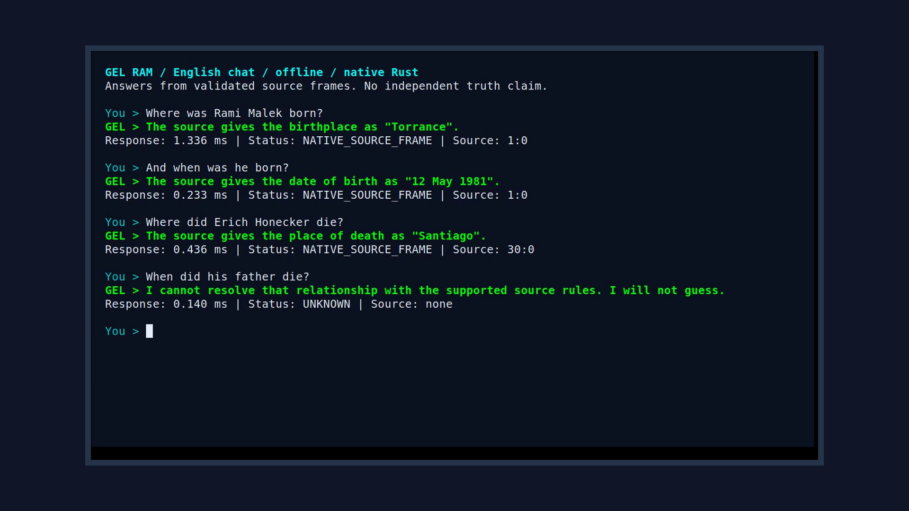
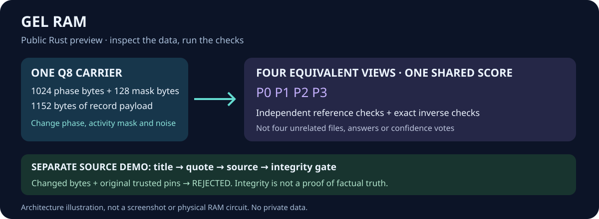
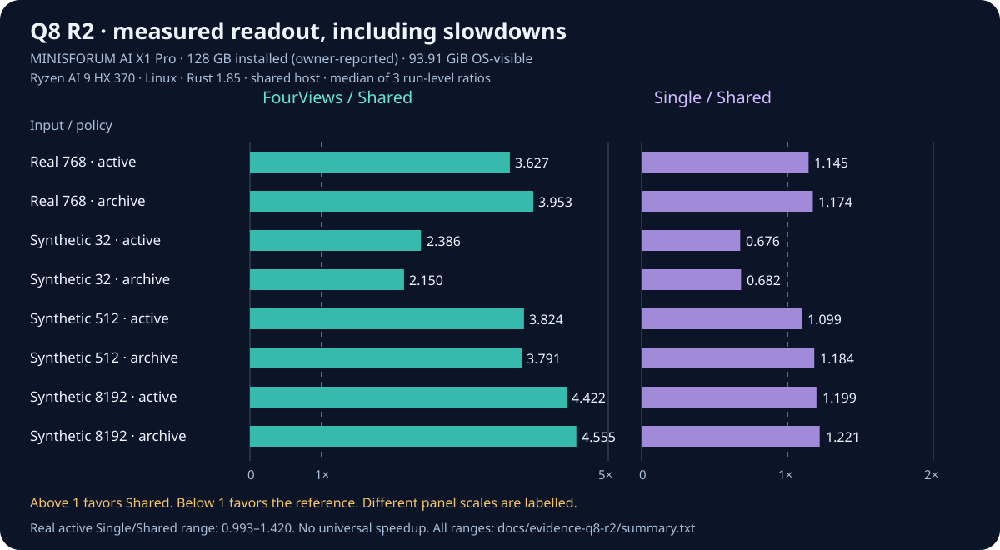

# GEL RAM

**Native Rust memory/readout research: exact source-bound readout, experimental Q8 coordinate views, reproducible verification, and explicit UNKNOWN when evidence is insufficient.**

> New public document-readout update, not a new tagged release. Start with
> [what changed and what remains private](RELEASE-NOTES-DOCUMENT-CANDIDATE.md).

## Try the new document readout

```text
cargo run --locked --offline -p gel-source --example source_find -- "garbage collection"
```

An actual pinned Rust Book excerpt → original UTF-8 quote and source SHA256
→ measured validation/search time → rejection of modified source bytes.
Try `"ownership"` or `"a nonexistent phrase"` to see multiple matches or UNKNOWN.
This is bounded token-phrase extraction, not a conversational model, semantic
search, encrypted storage or Ocean throughput. [Contract and reproduction](docs/DOCUMENT-READOUT.md).

[](media/GEL-RAM-HARDWARE-EN-CENTERED-90s.mp4)

▶ **[Watch the 90-second native demo](media/GEL-RAM-HARDWARE-EN-CENTERED-90s.mp4)** · [60-second continuous chat](media/GEL-RAM-CONTINUOUS-CHAT-EN-60s.mp4) · [Film guide and evidence limits](media/FILMS-GUIDE.md) · [Publication status](CANDIDATE-STATUS.md)

The films preview a separate private native Rust application. They show bounded source-frame answers, contextual follow-up and explicit UNKNOWN cases; they do **not** ship the private chat engine, private bank, encoder or speaker and do not prove unrestricted AI capability.

A Rust memory core for an AI knowledge bank: exact binary ORB readout,
experimental Q8 coordinate views, and source-bound quotations.
**A verifiable public system — not a complete AI model or the private research system.**

## New: reproducible Ocean Scale research bundle

[Download the Rust source + raw evidence bundle](research/ocean-scale-r3.tar.gz)
or start with the [Ocean Scale guide](docs/OCEAN-SCALE.md).
It includes the experimental reader, incremental snapshot/journal recovery,
sealed-copy mapping, vendored dependencies and a verifier that runs **111 tests**.

On the measured Ryzen AI 9 HX 370 host, full **10M-record scan + top10 + decision**
had EXACT p50 **615–705 ms** in two longer 24-worker runs (100 observations each).
All raw runs, including slower ones, are included. This is synthetic numerical
readout, **not semantic AI accuracy** or microsecond search across the Ocean.
The research code is separate from the stable public workspace; it does not
replace the v0.3.0 reader or claim a new tagged release.



## Run it yourself

Requires Git and Rust via rustup. Use a new checkout; initial installation and
dependency fetching need internet. Subsequent commands use locked offline builds.
The repository pins Rust 1.85.0.

```text
git clone https://github.com/Gelram-project/gel-ram.git
cd gel-ram
rustup toolchain install 1.85.0 --profile minimal --component rustfmt --component clippy
cargo fetch --locked
cargo run --locked --offline -p xtask -- verify
```

Expected: `GEL_VERIFY_ALL=PASS`. These are the public `main` verification
instructions for the current v0.3.0 line. No model or private bank is needed.

### Change the numeric input

```text
cargo run --locked --offline --release -p gel-phase-quad --example quad_playground -- --interactive
```

Try `phase 128`, `mask 3`, `noise 100`, `show`, then `quit`.
See each of four independently evaluated reference views, the shared score,
inverse checks and one-read timing. A phase shift of 128 gives an opposite
phase for the dense noiseless fixture; `mask 0` makes the body inactive.
`--demo` runs without interaction. This is a synthetic numeric experiment,
not four independent answers or a benchmark of conversation quality.

### Read a quote and reject a modification

```text
cargo run --locked --offline --release -p gel-source --example source_readout -- "Demo vessel"
```

Expected: title → exact quote → source entry/section/byte range → original
SHA-256 pins → rejection when 2 bar is changed to 9 bar. Final marker:
`SOURCE_E2E=PASS`. This built-in synthetic fixture is not real-world knowledge.
Pins prove correspondence to approved bytes, not truth or relevance.

### Read an introduction split into parts

```text
cargo run --locked --offline -p gel-source --example source_parts
```

Synthetic PL/EN examples return numbered parts in order, each with its own
exact quote, address, byte range, hash and source generation. Gaps, duplicate
numbers and ambiguous titles are rejected. Detecting a missing final part
requires an independently known expected count. Final marker:
`SOURCE_PARTS_E2E=PASS`. [Contract and limitations](docs/SOURCE-PARTS.md).

### Read real source material offline

```text
cargo run --locked --offline -p gel-source --example source_real -- "Rust ownership"
```

Three actual paragraphs from the MIT-licensed Rust Book, pinned to an upstream
revision: ordered quotes, source URL, byte ranges and rejection of modified
text/catalog. Expected: `SOURCE_REAL_E2E=PASS`. No model or private bank needed.
This demonstrates approved-source integrity, not semantic understanding or Q8
encoding. [Provenance, license and limits](docs/REAL-SOURCE-DEMO.md).

### Generate a complete local report

Choose a NEW directory outside the checkout, with an existing parent:

```text
cargo run --locked --offline -p xtask -- report ../gel-report-new
```

For a reviewed source archive without Git metadata, append its independently
approved manifest pin:

```text
cargo run --locked --offline -p xtask -- report ../gel-report-new REVIEWED_MANIFEST_SHA256
```

Archive mode validates the complete source inventory before and after the run;
it records Git revision as unavailable instead of inventing one. A checkout can
also supply the pin. Without it, Git metadata is not a complete content snapshot.

The Rust runner records toolchain, revision, working-tree changes, available
parallelism, correctness and every configured timing run, including slow cases.
Linux additionally reports CPU model and system memory; other systems explicitly
mark those fields unmeasured. It stops on failure or reference fallback, retains
partial logs and writes the COMPLETE.txt marker only after success. No automatic upload.
Review logs for local paths before sharing. [Protocol and scope](docs/PUBLIC-DEMO.md).

Maintainers can also [check and copy an exact reviewed source snapshot](docs/SOURCE-BUNDLE.md)
with a separately recorded SHA-256 manifest pin. This never uploads files or
approves a legal claim; private data and licensing still require review.

## Native demonstration films

The repository includes two owner-authorized English terminal demonstrations of
a separate private native Rust application. They show live bounded source-frame
answers and explicit UNKNOWN cases. They do **not** ship the private chat engine,
private bank, encoder or speaker.

The displayed reply timings belong only to those bounded routes and that recorded
MINISFORUM AI X1 Pro run. They are not token/s figures, general LLM benchmarks or
proof of unrestricted AI capability. See [the film guide](media/FILMS-GUIDE.md)
and [media rights](media/RIGHTS.md).

## What was measured



R2, MINISFORUM AI X1 Pro (owner-reported model and 128 GB installed RAM),
Ryzen AI 9 HX 370, Linux, Rust 1.85.0, shared host. The OS reported about
93.91 GiB total usable RAM, not installed capacity or free memory.
[Hardware provenance and measurement limits](docs/HARDWARE.md).
On the private 768-record
input, median FourViews/Shared was **3.627×** BodyActivity and **3.953×** Archive.
Against a single canonical reader the medians were 1.145× and 1.174×; the
BodyActivity range includes **0.993×**, a slower Shared run. Small 32-record
fixtures favor the single reader. No universal speedup is claimed.

All 8,355,840 V2 and 2,509,056 canonical-baseline comparisons passed in R2.
These repeat the same numeric datasets; they are not independent semantic questions.
Timing ratios are independently recomputed from raw timed rounds, not trusted
from summary fields. [All values, ranges and raw logs](docs/Q8-CANDIDATE-R2-AUDIT.md).

## What “four views” means

The public Q8 record has 1024 phase bytes plus 128 mask bytes: **1152 bytes**.
Four reversible coordinate views share one stored carrier and one score when
matching transforms are applied to query and candidate. This avoids repeated
work; it does not store four unrelated files in the same capacity.
Q8 means 256 phase levels, not a 256-bit record. Runtime tables and buffers cost
additional memory. The playground distinguishes payload sizes from process RSS
(Linux only); its single-read timing is not a robust performance benchmark.

No private encoder, media bank, conversation, LLM, physical RAM fingerprint,
PUF or blockchain network is included. The source catalog is separate from the
numeric Q8 demonstration; no hidden text-to-Q8 encoder is implied.

### Illustrated guide / przewodnik graficzny

[](docs/ILLUSTRATED-GUIDE.md)

The hand-drawn artwork is AI-assisted educational illustration, not a RAM
photograph, measurement or working graphical interface. The dots are illustrative,
not a bit-by-bit map. [English and Polish illustrations, explanation and evidence limits](docs/ILLUSTRATED-GUIDE.md).

## Evidence and development

1. [Current reporting fixes and demos](docs/PUBLIC-DEMO.md)
2. [Source-readout update notes](RELEASE-NOTES-SOURCE-CANDIDATE.md)
3. [Historical source-candidate validation](docs/SOURCE-CANDIDATE-VALIDATION.md)
4. [Q8 contract](docs/Q8-QUAD.md) · [Source readout](docs/SOURCE-READOUT.md)
5. [Initial candidate results](docs/Q8-EVIDENCE-CANDIDATE.md) · [R2 audit](docs/Q8-CANDIDATE-R2-AUDIT.md)
6. [Historical README and results](README-HISTORY-R2.md) · [Roadmap](docs/ROADMAP.md)
7. [Contributing](CONTRIBUTING.md) · [Security](SECURITY.md)

CI executes workspace tests on Linux, Windows and macOS. Linux also validates the
complete source SHA-256 manifest, runs full verification and an independent integrity
audit. CI correctness is separate from the recorded hardware timing campaigns.
New PR changes must pass new CI.

Independent reproduction, Unicode edge cases and platform regression tests are
especially useful contributions. Include revision, hardware, commands, all raw
results and failures — not only the fastest measurement.

## About and licensing

GEL RAM is an independent hobby project by RR, developed with AI assistance
including OpenAI Codex. Evidence and explicit limitations matter more than labels.

The active public license for GEL RAM-owned material in this distribution is
**GEL RAM Noncommercial Reciprocal License 1.0**. Noncommercial use, modification,
sharing and free non-production Evaluation are permitted on its terms. Any
Monetized Use requires a separate written Commercial Agreement. [License](LICENSE) ·
[Licensing details](LICENSING.md) · [Commercial licensing](COMMERCIAL-LICENSE.md).

The included Rust Book excerpt remains MIT-licensed; third-party rights remain
separate. Project-owned films and screenshots follow [media/RIGHTS.md](media/RIGHTS.md).
The historical `docs/licensing-next/` directory is not an additional active grant.

Public attribution remains RR — GEL RAM Project, a pseudonym. Contractual and
CLA matters use the project email privately; completed personal records do not
belong in this repository. See [publication status](CANDIDATE-STATUS.md).

Historical v0.2.x grants remain historical grants and are not rewritten by the
v0.3.0 public baseline. Private archival copies preserve that history without
making the old Git history part of the current public repository.
