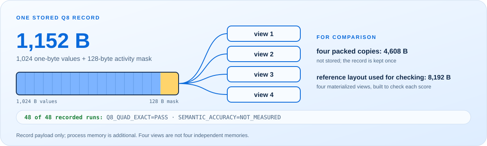
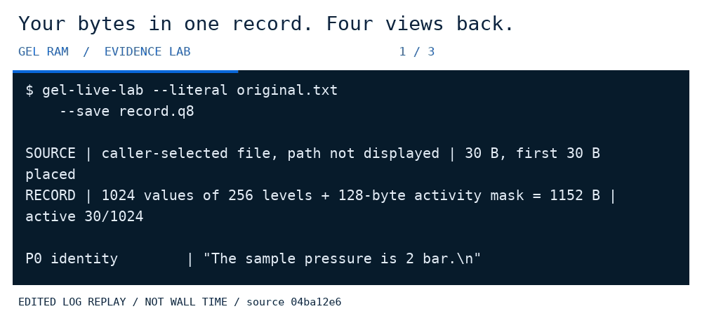

# GEL RAM

<!-- GEL_MULTIMEDIA_PRESENTATION_V1 -->
<picture>
  <source media="(prefers-reduced-motion: reduce) and (prefers-color-scheme: dark)" srcset="media/presentation/header-still-dark.svg">
  <source media="(prefers-reduced-motion: reduce)" srcset="media/presentation/header-still-light.svg">
  <source media="(prefers-color-scheme: dark)" srcset="media/presentation/header-dark.svg">
  
</picture>

**GEL RAM prints knowledge into memory as fixed Q8 records, instead of training
it into model weights, and reads the records back exactly, working toward
hardware-level memory computation.** The goal is a text AI that answers in
Polish and English from what it holds, or says it does not know.

The step that prints text into records is private, so the Q8 records in this
checkout hold synthetic values or literal bytes, and its tools do not
answer natural-language questions.
This repository does not establish hardware-level memory computation
([claim registry](docs/CLAIMS.md): `NOT_ESTABLISHED`); the text AI is a goal,
not a result.

## One record, four exact views

<picture><source media="(prefers-color-scheme: dark)" srcset="media/presentation/record-dark.svg"></picture>

A record is stored once: 1,024 one-byte values and a 128-byte activity mask,
1,152 bytes. The reader exposes four equivalent views of it and, for each view,
returns the score a separate read of a materialized copy gives, bit for bit on
the same build and platform. Four packed copies would take 4,608 bytes. Four
views are not four independent memories, four votes or a 4× speedup, and 1,152
bytes is the record, not process memory. On the author's private ranking check,
a different task, Single still outperforms Quad in this run: top-1 379 against
371 of 400. [How each part is checked](#the-memory-core)

## Exact bytes, or a refusal

<picture><source media="(prefers-reduced-motion: reduce) and (prefers-color-scheme: dark)" srcset="media/gifs/05-integrity-dark.png"><source media="(prefers-reduced-motion: reduce)" srcset="media/gifs/05-integrity-light.png"><source media="(prefers-color-scheme: dark)" srcset="media/gifs/05-integrity-dark.gif"></picture>

The public collection tool builds a collection from your own files; it does not
print Q8 records, but it follows the same rule. Each quotation comes back byte
for byte with its byte range; replace a document and its earlier citation is
refused; change one byte of a saved snapshot and loading it with the pin you
kept fails. A matching pin proves these are the bytes you kept, not that the
source is true; a hash is not a signature.
Replays of real public-tool runs: [this one, as text](media/gifs/05-integrity.txt) · [old citation refused](media/gifs/02-stale-light.gif) · [verified restart](media/gifs/01-evidence-light.gif) · [all six](#see-it-in-action)

## A killed process loses nothing it confirmed

In the recorded crash series the public collection tool was killed at random
moments in 200 trials while its collection grew: 0 of 2,683 acknowledged
snapshots were lost, none was partial, and every trial resumed to the
uninterrupted result ([crash series](docs/CRASH-SERIES.md)). Injected write
failures, permission denial and a full disk leave the previous snapshot intact
([fault tests](docs/PUBLICATION-FAULT-TESTS.md)). A separate private series
checked 235,712 confirmed records after kills; none was lost. A process kill is
not a power cut: power-loss durability is not established.

## UNKNOWN when the bank does not hold the answer

Of 599 frozen questions written to have no answer in the bank (399 about real
topics outside it, checked by title, and 200 about invented subjects; the set
page lists one exception), a private development build said UNKNOWN to 573 and
answered 26. Silence costs answers too: it said UNKNOWN to 557 of the 982
questions that have one. The build and its bank are private;
`xtask answer-bench check` re-scores every recorded answer.
[Question set v7 and its limits](docs/answer-or-abstain-v7/README.md)

## Run it now

Install [Git](https://git-scm.com/) and [rustup](https://rustup.rs). Cloning, the
toolchain and the fetch need a network; after that Cargo runs offline. No model
and no private data are involved. Run each line separately:

```sh
git clone https://github.com/Gelram-project/gel-ram.git
cd gel-ram
rustup toolchain install 1.85.0 --profile minimal --component rustfmt --component clippy
cargo fetch --locked
cargo run --locked --offline --release -p gel-live-lab -- --literal README.md
cargo run --locked --offline --release -p gel-phase-quad --example quad_compare
cargo run --locked --offline -p xtask -- mutation-matrix
cargo run --locked --offline -p xtask -- crash-series 20
cargo run --locked --offline --release -p gel-physics -- 5
```

| Run | Line to check | What it shows | Its limit |
|:---|:---|:---|:---|
| Your bytes, one record | `ROUNDTRIP=4/4 DIFFERENT_BITS=0`, `TAMPER=REJECTED`, `GEL_LIVE_LAB_LITERAL=PASS` | The first 1,024 bytes of a regular file you name in place of README.md (1 byte to 64 MiB), in one record; its four views restored bit for bit; a changed byte rejected under the pin ([how](docs/LIVE-LAB.md#your-own-bytes-in-one-record)) | Literal bytes, not GEL knowledge printing; no meaning and no search |
| One record, four views | `Q8_QUAD_EXACT=PASS SEMANTIC_ACCURACY=NOT_MEASURED` | 512 synthetic records of 1,152 bytes; each view's score equals a separate reference copy bit for bit | Meaning is not measured; a single reference view can still be read faster than the shared read |
| Changed bytes | `MUTATION_MATRIX=PASS mutants=179 …` | Every mutant of the three file formats in the matrix is refused under the original pin | A finite matrix, not every possible corruption |
| Kill while writing | `CRASH_SERIES=PASS trials=20 … acknowledged_lost=0 partial=0 resumed=20 …` | No acknowledged snapshot lost; every trial resumes to the same bytes | Unix hosts; the recorded run is Linux; a process kill, not a power cut |
| F0 memory physics | `GEL_PHYSICS_F0_V3`, then ns per step and GiB/s from 48 KiB to 256 MiB and random 32/64/128-byte fetches in a 64 MiB working set | What your own memory costs, measured instead of assumed | Nanoseconds and GiB/s only, no cycles; compare rows only within one machine and one output tag |

`cargo run --locked --offline -p xtask -- verify` runs the full public check,
including a smaller `quad_compare` run and, on Unix hosts, a five-trial crash
series; it ends with `GEL_VERIFY_ALL=PASS`.

[The memory core](#the-memory-core) · [Six workflows](#see-it-in-action) · [Checks](#what-the-public-checks-cover) · [External checks](docs/EXTERNAL-CHECKS.md) · [Quick start](#quick-start) · [Documentation](#documentation) · [License](#about-and-licensing)

## The memory core

The public core holds fixed records, reads them exactly and measures the memory
they live in. Each row names a test (`cargo test --locked --offline -p CRATE`)
or a command.

| Part | What it does | Check it |
|:---|:---|:---|
| ORB128 record (`gel-orb`) | One fixed 1,024-bit record of 128 bytes, 64-byte aligned; its bytes round-trip exactly | `exact_byte_roundtrip` · [format](docs/FORMAT.md) |
| Store (`gel-store`) | `.gel` files with a CRC64 over the header and over the payload; every single header bit flip, payload byte flip and truncation is rejected, and so is an older generation | `every_payload_byte_flip_is_rejected` · `generation_rollback_and_equal_generation_are_rejected` |
| Reader16 (`gel-reader`) | One fused comparison of two records returns 16 judgments; they are not 16 independent measurements. Progressive Top-K equals the full 128-byte Top-K exactly | `progressive_top_k_is_exactly_equal_to_full_top_k` · [Reader16](docs/READER16.md) |
| Exact structural rebuild (`gel-structural`) | A related record XOR the differing bits gives the exact record, or the rebuild fails | `exact_xor_roundtrip_is_bit_identical` · [contract](docs/STRUCTURAL-CODEC.md) |
| Record history (`gel-history`) | Every state appended to the history of one 128-byte record is stored as a literal copy or as the XOR residual from the state before it, never more than two residuals from a literal, and is rebuilt bit for bit, also from the reopened file; the decoder accepts only the bytes the encoder writes | `long_history_is_exact_and_residual_depth_never_exceeds_two` · `a_depth_byte_that_lies_is_refused` · [contract](docs/RECORD-HISTORY.md) |
| Four views of one Q8 record (`gel-phase-quad`) | One 1,152-byte record read through four equivalent views; each score equals the reference bit for bit; four packed copies would take 4,608 bytes and the materialized reference 8,192 | `storage_is_1152_bytes_and_every_bit_survives` · [contract](docs/Q8-QUAD.md) · [the 48 runs behind the card](docs/evidence-q8-current/README.md) · [the historical V1 runs, slower cases included](docs/Q8-QUAD-RESULTS.md) |
| Your bytes in one Q8 record (`gel-live-lab --literal`, over `gel-phase-quad`) | The first 1,024 bytes of one file as the values of one record, active where a byte was placed; each of the four views is restored to it with 0 different bits; its 1,164-byte file is rejected under the pin after any 1-byte change. Literal bytes, not GEL knowledge printing | `every_byte_value_restores_through_every_view` · `a_changed_byte_anywhere_is_rejected` · [live lab](docs/LIVE-LAB.md#your-own-bytes-in-one-record) |
| F0 memory physics (`gel-physics`) | Dependent pointer-chase latency and sequential read bandwidth from 48 KiB to 256 MiB, random 32/64/128-byte record fetches in a 64 MiB working set; nanoseconds and GiB/s only | `cargo run --locked --offline --release -p gel-physics -- 5` · [method](docs/PERFORMANCE.md) |

Tests hold five equalities:

```text
reference result      == optimized result      (gel-kernel: kernel_matches_reference)
full Top-K            == progressive Top-K     (gel-reader)
original record bytes == rebuilt record bytes  (gel-structural)
written store         == reopened store        (gel-store: persistence_roundtrip_and_payload_corruption_rejection)
appended state        == rebuilt state         (gel-history: long_history_is_exact_and_residual_depth_never_exceeds_two)
```

`cargo run --locked --offline --release -p gel-cli -- selftest` checks the record,
the store, Reader16 and the structural rebuild in one run and prints
`GEL_SELFTEST_V2=PASS` on its first line. This checkout does not print text into
records as GEL does: `--literal` only places bytes, and the printing step and its
bank are private.

## See it in action

**Actual public-tool runs, presented as six edited log replays.**
Each animation lasts 12 seconds; pacing is editorial, not execution time.
[Static view](media/gifs/STATIC.md) · [Full gallery](media/gifs/README.md) · [Original source and hashes](media/gifs/MANIFEST.txt)

<picture><source media="(prefers-color-scheme: dark)" srcset="media/presentation/flow-dark.svg"></picture>

### Six workflows, one evidence trail

Open a preview at full size to read the terminal text. All six existing scenarios
are visible here rather than hidden in collapsed sections. Their original
transcripts and source revisions remain unchanged.

<table>
<tr>
<td width="50%" valign="top"><picture><source media="(prefers-color-scheme: dark)" srcset="media/presentation/chips/01-dark.svg"></picture><h4>Exact quotes. A verifiable restart.</h4><a href="media/gifs/01-evidence-light.gif"><picture><source media="(prefers-reduced-motion: reduce) and (prefers-color-scheme: dark)" srcset="media/gifs/01-evidence-dark.png"><source media="(prefers-reduced-motion: reduce)" srcset="media/gifs/01-evidence-light.png"><source media="(prefers-color-scheme: dark)" srcset="media/gifs/01-evidence-dark.gif"></picture></a><p>Add a source, inspect its citation, save and reopen it in a separate process.</p><p><a href="media/gifs/01-evidence.txt">Transcript</a> · <a href="media/gifs/01-evidence-dark.gif">Dark full size</a></p></td>
<td width="50%" valign="top"><picture><source media="(prefers-color-scheme: dark)" srcset="media/presentation/chips/02-dark.svg"></picture><h4>Changed source. Old citation refused.</h4><a href="media/gifs/02-stale-light.gif"><picture><source media="(prefers-reduced-motion: reduce) and (prefers-color-scheme: dark)" srcset="media/gifs/02-stale-dark.png"><source media="(prefers-reduced-motion: reduce)" srcset="media/gifs/02-stale-light.png"><source media="(prefers-color-scheme: dark)" srcset="media/gifs/02-stale-dark.gif"></picture></a><p>Replace the source and inspect the refusal of the previous result.</p><p><a href="media/gifs/02-stale.txt">Transcript</a> · <a href="media/gifs/02-stale-dark.gif">Dark full size</a></p></td>
</tr>
<tr>
<td width="50%" valign="top"><picture><source media="(prefers-color-scheme: dark)" srcset="media/presentation/chips/03-dark.svg"></picture><h4>Backup. Inspect. Restore.</h4><a href="media/gifs/03-backup-light.gif"><picture><source media="(prefers-reduced-motion: reduce) and (prefers-color-scheme: dark)" srcset="media/gifs/03-backup-dark.png"><source media="(prefers-reduced-motion: reduce)" srcset="media/gifs/03-backup-light.png"><source media="(prefers-color-scheme: dark)" srcset="media/gifs/03-backup-dark.gif"></picture></a><p>Restore into a new path and check equality with the saved snapshot.</p><p><a href="media/gifs/03-backup.txt">Transcript</a> · <a href="media/gifs/03-backup-dark.gif">Dark full size</a></p></td>
<td width="50%" valign="top"><picture><source media="(prefers-color-scheme: dark)" srcset="media/presentation/chips/04-dark.svg"></picture><h4>One command. Inspect every result.</h4><a href="media/gifs/04-reproduce-light.gif"><picture><source media="(prefers-reduced-motion: reduce) and (prefers-color-scheme: dark)" srcset="media/gifs/04-reproduce-dark.png"><source media="(prefers-reduced-motion: reduce)" srcset="media/gifs/04-reproduce-light.png"><source media="(prefers-color-scheme: dark)" srcset="media/gifs/04-reproduce-dark.gif"></picture></a><p>Read the recorded strict reproduction result and its declared scope.</p><p><a href="media/gifs/04-reproduce.txt">Transcript</a> · <a href="media/gifs/04-reproduce-dark.gif">Dark full size</a></p></td>
</tr>
<tr>
<td width="50%" valign="top"><picture><source media="(prefers-color-scheme: dark)" srcset="media/presentation/chips/05-dark.svg"></picture><h4>Changed bytes. Retained pin. Refusal.</h4><a href="media/gifs/05-integrity-light.gif"><picture><source media="(prefers-reduced-motion: reduce) and (prefers-color-scheme: dark)" srcset="media/gifs/05-integrity-dark.png"><source media="(prefers-reduced-motion: reduce)" srcset="media/gifs/05-integrity-light.png"><source media="(prefers-color-scheme: dark)" srcset="media/gifs/05-integrity-dark.gif"></picture></a><p>A changed-byte copy is rejected against the original trusted hash.</p><p><a href="media/gifs/05-integrity.txt">Transcript</a> · <a href="media/gifs/05-integrity-dark.gif">Dark full size</a></p></td>
<td width="50%" valign="top"><picture><source media="(prefers-color-scheme: dark)" srcset="media/presentation/chips/06-dark.svg"></picture><h4>Your bytes. One record. Four views back.</h4><a href="media/gifs/07-literal-light.gif"><picture><source media="(prefers-reduced-motion: reduce) and (prefers-color-scheme: dark)" srcset="media/gifs/07-literal-dark.png"><source media="(prefers-reduced-motion: reduce)" srcset="media/gifs/07-literal-light.png"><source media="(prefers-color-scheme: dark)" srcset="media/gifs/07-literal-dark.gif"></picture></a><p>Place a file's first bytes in one record, restore its four views and reject a changed byte.</p><p><a href="media/gifs/07-literal.txt">Transcript</a> · <a href="media/gifs/07-literal-dark.gif">Dark full size</a></p></td>
</tr>
</table>


The earlier [70-second Evidence Lab film](media/GEL-EVIDENCE-LAB-EN.mp4),
its [original process logs](media/EVIDENCE-LAB-GUIDE.md) and
[open human review](docs/MEDIA-DECODE-REVIEW.md) remain separate historical material.
New presentation is not a new execution, benchmark or human acceptance.

**Full-page edition:** [README-MULTIMEDIA.html](README-MULTIMEDIA.html).
Open that file from this checkout in a browser for the responsive blue-panel layout,
light/dark backgrounds and a still-image control. GitHub displays HTML files as
source, not as a hosted page; this repository does not enable Pages.
[Presentation guide](docs/README-PRESENTATION.md).

## What the public checks cover

<picture><source media="(prefers-color-scheme: dark)" srcset="media/presentation/facts-dark.svg"></picture>

<picture><source media="(prefers-color-scheme: dark)" srcset="media/presentation/wall-dark.svg"></picture>

Each cell is one documented property on one CI platform. On every platform the
[CI evidence collector](docs/CI-EVIDENCE.md) withholds COMPLETE unless each test
named in the [property map](docs/PROPERTY-TESTS.md) ran and passed exactly once;
declared Unix-only tests are exempt on Windows. The image shows this rule, not
the outcome of one run: read that in the run's CI report.

<picture><source media="(prefers-color-scheme: dark)" srcset="media/presentation/bars-dark.svg"></picture>

Every mutant of the [format mutation matrix](docs/MUTATION-MATRIX.md) is read
twice: with the original pin, which must refuse any changed byte, and with a
recomputed pin, which lets the structural rules decide. The bars count the
committed report; `xtask verify` regenerates it and fails on any difference.
Both images are drawn from these files when the presentation is built, and the
read-only presentation check fails if they drift.

## What you can check without the private code

GEL's own answers come from a private implementation and its bank, so they
cannot be re-run from this checkout. Everything around them can:

| What | How | You need |
|:---|:---|:---|
| The public tools do what these pages say | `cargo run --locked --offline -p xtask -- verify` ends with `GEL_VERIFY_ALL=PASS` | this checkout, Rust 1.85.0 |
| No acknowledged snapshot is lost when the process is killed | `cargo run --locked --offline -p xtask -- crash-series` ends with `CRASH_SERIES=PASS` | this checkout on a Unix host |
| The scoring of every recorded answer | `cargo run --locked --offline -p xtask -- answer-bench check` re-scores them under two rules and compares the published tables | this checkout |
| That a private result was not changed after publication | where a result lists an evidence identity, it is the SHA-256 of its private artifacts; the ranking, resident-read and integrity-gate rows have none ([measured progress](docs/MEASURED-PROGRESS.md)); this shows tampering, it does not verify the result | nothing |

An independent run of the public tools on a second machine is still missing
([issue #20](https://github.com/Gelram-project/gel-ram/issues/20)).

## External checks

Frozen question sets v1 to v7 check private development builds from the
outside; each set page names the build it measured. Every question, expected
answer and recorded answer is published, and `xtask answer-bench check`
re-scores them on every verify run. GEL's main numbers on each set, the
reference search engines and what has nothing to compare with are on one page:
[external checks](docs/EXTERNAL-CHECKS.md).

## Private measurements

Author-run diagnostics of the separate private implementation (ranking within a
known slot, resident read times, the answer verdict and the kill series of its
store) cannot be re-run from this checkout. They are listed with their scope in
[measured progress](docs/MEASURED-PROGRESS.md), with the SHA-256 of their
private artifacts where one is given (the ranking, resident-read and
integrity-gate rows have none), and the [claim registry](docs/CLAIMS.md) lists
them as `MEASURED_LOCAL`.

## The public collection tool

Build a collection from your own UTF-8 files, quote it exactly and reopen it
with the pin you kept. It is phrase lookup, not question answering; start with
the [quick start](#quick-start).

### What you can inspect

| Source-bound retrieval | Explicit failure states | Save and reopen |
|:---|:---|:---|
| Original UTF-8 quotations, document identifiers and byte ranges. | UNKNOWN is different from an incomplete search or an error. | Save to a new path and reopen with an independently retained SHA-256 pin. |
| [Readout contract](docs/DOCUMENT-READOUT.md) | [Batch schema and exit codes](docs/EVIDENCE-BATCH.md) | [Collection guide](docs/EVIDENCE-LAB.md) |

A citation check establishes correspondence to the retained source bytes.
**It does not establish that the source is true.** Search is bounded token-phrase
retrieval, not unrestricted question answering. Snapshots and backups contain
plaintext; hash verification is not encryption or a signature.

### Update, restart and reject a corrupted copy

<details>
<summary><strong>Open the recorded final screen and the executable scenario</strong></summary>

[](media/evidence-lab/03-update-restart-102s.png)

[Scenario, commands and checks](docs/UPDATE-RESTART-SCENARIO.md).
The still does not prove that every intermediate step was reviewed.

</details>

[All media and their scope](media/INDEX.md).
No generated terminal mockup or illustrative timing is used as execution evidence.

## Quick start

> **Version 0.6.0.** The instructions below use the `v0.6.0` tag. Record the exact
> commit you test.
> [Release notes](RELEASE-NOTES-v0.6.0.md) · [Publication status](CANDIDATE-STATUS.md) · [Tagged releases](https://github.com/Gelram-project/gel-ram/releases)

Use a new checkout. Install [Git](https://git-scm.com/) and [rustup](https://rustup.rs)
first. Cloning, toolchain installation and dependency fetching need a network;
the final command uses locked offline dependencies. Run each line separately,
including in Windows PowerShell.

```sh
git clone https://github.com/Gelram-project/gel-ram.git
cd gel-ram
git checkout v0.6.0
git rev-parse HEAD
rustup toolchain install 1.85.0 --profile minimal --component rustfmt --component clippy
cargo fetch --locked
cargo run --locked --offline --release -p gel-live-lab --bin gel-evidence -- --demo
```

Expected completion marker: `GEL_EVIDENCE_DEMO=PASS`.
This is an expected result to check, not a claim about a run you have not performed.

For the interactive prompt, run:

```sh
cargo run --locked --offline --release -p gel-live-lab --bin gel-evidence
```

Then enter these commands inside Evidence Lab:

```text
add crates/gel-source/fixtures/evidence-lab/memory.txt
find ram is volatile
proof 1
```

For your own UTF-8 files, use `add PATH`, `list`, `find PHRASE` and `proof 1`.
Use `save NEW_PATH`, retain the printed SHA-256 independently, exit, and reopen
with `load SHA256 PATH`. `replace ID PATH` and `drop ID` invalidate earlier
results. Nothing is uploaded or automatically saved by Evidence Lab.

[Full guide and limits](docs/EVIDENCE-LAB.md) · [More examples](docs/TRY-IT.md) ·
[Binary packaging and publication conditions](docs/BINARIES.md)

## Three practical workflows

| Goal | Public interface | Contract and evidence |
|:---|:---|:---|
| Integrate with scripts or CI | `gel-evidence --batch` produces JSON Lines, with separate status and diagnostic channels. | [Versioned schema, exit codes and limits](docs/EVIDENCE-BATCH.md) |
| Keep and recover a collection | `gel-backup` creates and inspects backups, restores to a new path and distinguishes withdrawal from deletion. | [Backup and restore](docs/BACKUP.md) |
| Challenge the parser | Run the finite format-mutation campaign against pinned fixtures. | [Mutation matrix and exclusions](docs/MUTATION-MATRIX.md) |

A missing committed backup manifest is not a complete backup. Restore must not
overwrite an existing snapshot. Directory durability is platform-specific;
`clear`, `drop`, withdrawal and file deletion do not erase all existing copies.
Read the backup contract before using these operations on important data.

## Reproduce the checks

After the quick-start setup, choose a new output directory outside the checkout:

```sh
cargo run --locked --offline -p xtask -- verify
cargo run --locked --offline -p xtask -- reproduce ../gel-repro-new
```

Expected markers include `GEL_VERIFY_ALL=PASS` and `REPRODUCTION=PASS` within
their declared scope. Read the report for failed, skipped and unmeasured steps;
a final marker is not proof of every feature or an independent second-host result.

Cargo's offline flag is not a system-wide network barrier. For the Linux
namespace procedure and `--require-isolation`, follow the
[reproduction guide](docs/REPRODUCE.md) and [isolation contract](docs/REPRODUCE-ISOLATED.md).
Windows and macOS limitations are recorded rather than counted as Linux checks.

[Per-platform CI evidence](docs/CI-EVIDENCE.md) · [Executable claim registry](docs/CLAIMS.md) ·
[Report an independent reproduction](https://github.com/Gelram-project/gel-ram/issues/new?template=reproduction.yml)

Reports and test data stay local unless you share them. Review paths, diagnostics
and source content before publishing a report. Keep slower runs and failures.

## Evidence, not a universal speed claim

| Evidence | What it establishes | Where to inspect it |
|:---|:---|:---|
| Public grep / SHA-256 comparison | A scoped comparison on a declared corpus, including cases where GEL is slower. Matching rules and timed work are not identical. | [Method, disagreement cases and raw results](docs/BENCHMARK-GREP.md) |
| Collection update measurements | Declared mutation-time and memory measurements, with measurement boundaries and exclusions. | [Mutation comparison](docs/MUTATION-COMPARISON.md) |
| F32, F16 and affine Q1 to Q16 reference | Separate byte, numerical-error and ranking checks on public fixtures. Not integration with every reader or private format. | [Precision matrix](docs/PRECISION-MATRIX.md) · [Codec scope](docs/CODEC-SCOPE.md) |
| Historical Ocean measurements | Author-reported CPU/RAM full scans; the research archive is not in this checkout. | [Historical results and limitations](docs/OCEAN-SCALE.md) |
| Author-reported GEL component measurements | Separate tasks whose private implementations cannot be reproduced from this repository. Not an end-to-end speedup over Ocean. | [Method and retained public observations](docs/GEL-EXPERIMENTAL-MEASUREMENTS.md) |

Do not divide timings from different tasks to claim a speedup. Numerical checks
are not semantic recall. Use the [measurement protocol](docs/MEASUREMENT-PROTOCOL.md)
and the [roadmap](docs/ROADMAP.md) to distinguish implemented checks, local
measurements, independent acceptance and open research.

<details>
<summary><strong>Explore the public numerical readout and source formats</strong></summary>

[Public architecture](docs/ARCHITECTURE.md) · [Q8 contract](docs/Q8-QUAD.md) ·
[Source readout](docs/SOURCE-READOUT.md) · [Multipart sources](docs/SOURCE-PARTS.md) ·
[Source building](docs/SOURCE-BUILDER.md) · [Storage format](docs/FORMAT.md)

The source panel and synthetic Q8 panel are separate. Four reversible coordinate
views are not four independent datasets; a Q label alone says nothing about
natural-language quality. The public numerical demonstration is available through:

```sh
cargo run --locked --offline --release -p gel-phase-quad --example quad_playground -- --interactive
```

[Illustrated guide](docs/ILLUSTRATED-GUIDE.md) ·
[Live Lab](docs/LIVE-LAB.md) · [Real-source fixture and provenance](docs/REAL-SOURCE-DEMO.md)

</details>

## Documentation

| Start and use | Inspect and reproduce | Project and history |
|:---|:---|:---|
| [Project map](docs/START-HERE.md) | [Verified results and scope](docs/VERIFIED-RESULTS.md) | [Public roadmap](docs/ROADMAP.md) |
| [Evidence Lab](docs/EVIDENCE-LAB.md) | [Publication fault tests](docs/PUBLICATION-FAULT-TESTS.md) | [Publication status](CANDIDATE-STATUS.md) |
| [Batch interface](docs/EVIDENCE-BATCH.md) | [Source bundle verification](docs/SOURCE-BUNDLE.md) | [Media index](media/INDEX.md) |
| [Backup / restore](docs/BACKUP.md) | [Dependency inventory](docs/DEPENDENCY-INVENTORY.md) | [Release notes](RELEASE-NOTES-v0.6.0.md) |
| [Q8 contract](docs/Q8-QUAD.md) · [Reader16](docs/READER16.md) | [Claim registry](docs/CLAIMS.md) · [Crash series](docs/CRASH-SERIES.md) | [External checks](docs/EXTERNAL-CHECKS.md) · [Measured progress](docs/MEASURED-PROGRESS.md) |

Earlier README versions and the notes of earlier releases are no longer kept in
the tree; they remain in the git history. Detailed reports and raw evidence
remain in their original locations.

## About and licensing

GEL RAM is an independent hobby and research project by RR, developed with AI
assistance. This public repository is not the complete private research system.

GEL RAM-owned material uses **GEL RAM Noncommercial Reciprocal License 1.0**.
It is source-available, not an OSI-approved open-source license. Noncommercial
use and non-production Evaluation are governed by that license; Monetized Use
requires a separate signed Commercial Agreement. This README adds no rights.

[LICENSE](LICENSE) · [Licensing guide](LICENSING.md) · [Commercial terms](COMMERCIAL-LICENSE.md) ·
[Third-party notices](THIRD-PARTY-NOTICES.md) · [Media rights](media/RIGHTS.md)

Third-party material retains its own terms, including the MIT-licensed Rust Book
fixture and the Wikipedia passages (CC BY-SA 4.0) quoted in the measurement sets.
Historical grants are not rewritten. The license texts in force are pinned in
[docs/LICENSE-PINS.md](docs/LICENSE-PINS.md).

[Contributing](CONTRIBUTING.md) · [Security reporting](SECURITY.md) · [CLA privacy](CLA-PRIVACY.md)

Public attribution: **RR — GEL RAM Project**. Contract and CLA enquiries use
`gelram.licensing@gmail.com`; completed agreements and personal records stay private.
