# GEL RAM

<!-- GEL_MULTIMEDIA_PRESENTATION_V1 -->
<picture>
  <source media="(prefers-reduced-motion: reduce) and (prefers-color-scheme: dark)" srcset="media/presentation/header-still-dark.svg">
  <source media="(prefers-reduced-motion: reduce)" srcset="media/presentation/header-still-light.svg">
  <source media="(prefers-color-scheme: dark)" srcset="media/presentation/header-dark.svg">
  
</picture>

**What GEL RAM is working toward.** A text AI whose knowledge is written into
memory rather than trained into model weights, so adding knowledge needs no
fine-tuning. It answers in Polish or English from that knowledge and shows the
source it used, or says plainly that it does not know, and it holds a free
conversation in both languages. A copy kept on disk means a restart or a crash
loses nothing that was saved. **This is the goal, not a result of this
repository**: the sections below state exactly what has been checked so far.

**Where the numbers below come from.** The answers counted in the cards were
given by a private development build and its private bank, not by the tools in
this checkout. The first card is the newest frozen question set (v7); the example and
the answer grid show an earlier run on question set v1, the 80 questions also put to
three language models. Every question is published with its expected answer
and source passage: [the 982 of question set v7](docs/answer-or-abstain-v7/with-answer-questions.txt)
and its [599 questions whose answer is not in the bank](docs/answer-or-abstain-v7/no-answer-questions.txt),
[the 990 of question set v6](docs/answer-or-abstain-v6/with-answer-questions.txt),
[the 987 of question set v5](docs/answer-or-abstain-v5/with-answer-questions.txt),
[the 985 of question set v4](docs/answer-or-abstain-v4/with-answer-questions.txt)
and [the 80 of question set v1](docs/answer-or-abstain/with-answer-questions.txt). So is
every recorded answer, and `xtask answer-bench check` re-scores them on each
verify run. Free conversation has not been measured yet.

<picture><source media="(prefers-color-scheme: dark)" srcset="media/presentation/glance-dark.svg"></picture>

<picture><source media="(prefers-color-scheme: dark)" srcset="media/presentation/question-path-dark.svg">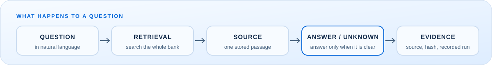</picture>

<picture><source media="(prefers-color-scheme: dark)" srcset="media/presentation/example-41-dark.svg"></picture>

<picture><source media="(prefers-color-scheme: dark)" srcset="media/presentation/answer-dots-dark.svg">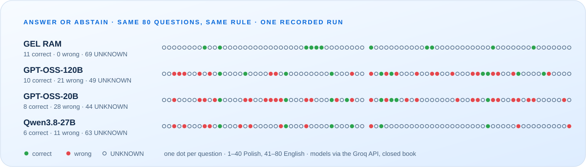</picture>

Recordings: [changed byte refused](media/gifs/05-integrity-light.gif) · [stale citation refused](media/gifs/02-stale-light.gif) · [verified restart](media/gifs/01-evidence-light.gif) · [backup restored](media/gifs/03-backup-light.gif)

<picture><source media="(prefers-color-scheme: dark)" srcset="media/presentation/truth-surface-dark.svg">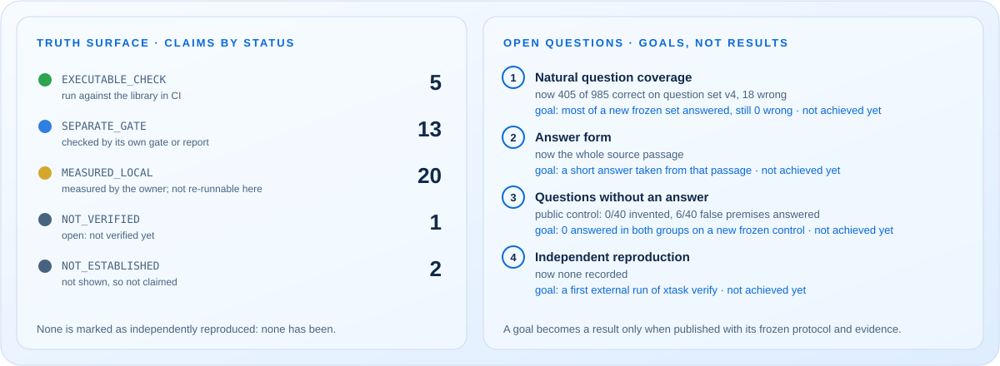</picture>

[Full comparison](docs/GEL-BESIDE-GROQ.md) · [Claim registry](docs/CLAIMS.md) · [Measured progress](docs/MEASURED-PROGRESS.md) · [Try it yourself](#quick-start) · [Documentation](#documentation)

<picture><source media="(prefers-color-scheme: dark)" srcset="media/presentation/flow-dark.svg"></picture>

**What this checkout runs.** Local Rust tools for phrase lookup in your own
files: exact source-bound quotations, refusal of a stale citation and
independently pinned snapshots. They do not answer natural-language questions;
that is the goal above.

<picture><source media="(prefers-color-scheme: dark)" srcset="media/presentation/facts-dark.svg"></picture>

[Quick start](#quick-start) · [Six workflows](#see-it-in-action) · [Checks](#what-the-public-checks-cover) · [Reproduce](#reproduce-the-checks) · [Documentation](#documentation) · [License](#about-and-licensing)

> **Version 0.5.3.** The instructions below use the `v0.5.3` tag. Record the exact
> commit you test.
> [Release notes](RELEASE-NOTES-v0.5.3.md) · [Publication status](CANDIDATE-STATUS.md) · [Tagged releases](https://github.com/Gelram-project/gel-ram/releases)

**Full-page edition:** [README-MULTIMEDIA.html](README-MULTIMEDIA.html).
Open that file from this checkout in a browser for the responsive blue-panel layout,
light/dark backgrounds and a still-image control. GitHub displays HTML files as
source, not as a hosted page; this repository does not enable Pages.
[Presentation guide](docs/README-PRESENTATION.md).

## See it in action

**Actual public-tool runs, presented as six edited log replays.**
Each animation lasts 12 seconds; pacing is editorial, not execution time.
[Static view](media/gifs/STATIC.md) · [Full gallery](media/gifs/README.md) · [Original source and hashes](media/gifs/MANIFEST.txt)

<picture><source media="(prefers-color-scheme: dark)" srcset="media/presentation/chips/05-dark.svg"></picture>

<picture><source media="(prefers-reduced-motion: reduce) and (prefers-color-scheme: dark)" srcset="media/gifs/05-integrity-dark.png"><source media="(prefers-reduced-motion: reduce)" srcset="media/gifs/05-integrity-light.png"><source media="(prefers-color-scheme: dark)" srcset="media/gifs/05-integrity-dark.gif">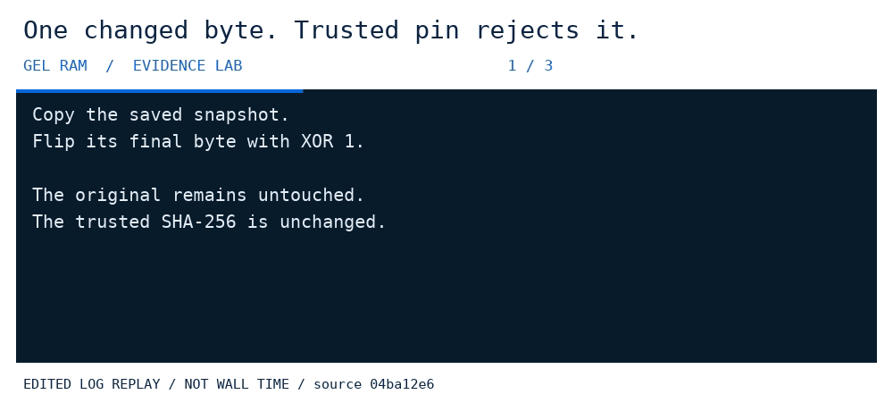</picture>

[Full transcript](media/gifs/05-integrity.txt) · [Full-size dark replay](media/gifs/05-integrity-dark.gif)

### Six workflows, one evidence trail

Open a preview at full size to read the terminal text. All six existing scenarios
are visible here rather than hidden in collapsed sections. Their original
transcripts and source revisions remain unchanged.

<table>
<tr>
<td width="50%" valign="top"><picture><source media="(prefers-color-scheme: dark)" srcset="media/presentation/chips/01-dark.svg"></picture><h4>Exact quotes. A verifiable restart.</h4><a href="media/gifs/01-evidence-light.gif"><picture><source media="(prefers-reduced-motion: reduce) and (prefers-color-scheme: dark)" srcset="media/gifs/01-evidence-dark.png"><source media="(prefers-reduced-motion: reduce)" srcset="media/gifs/01-evidence-light.png"><source media="(prefers-color-scheme: dark)" srcset="media/gifs/01-evidence-dark.gif">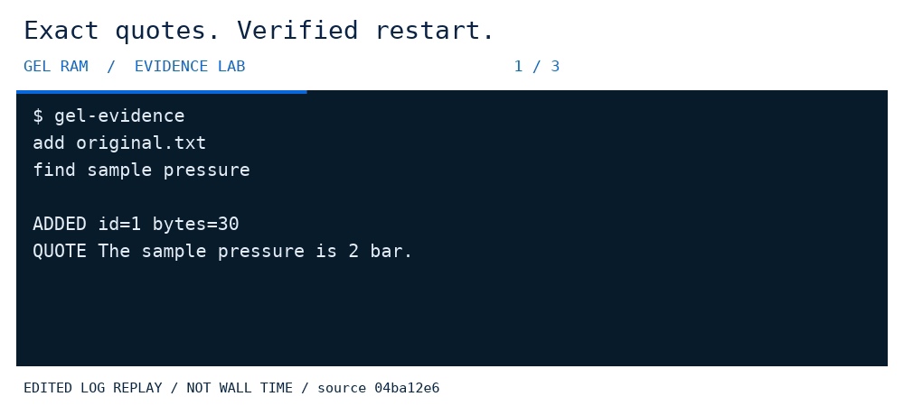</picture></a><p>Add a source, inspect its citation, save and reopen it in a separate process.</p><p><a href="media/gifs/01-evidence.txt">Transcript</a> · <a href="media/gifs/01-evidence-dark.gif">Dark full size</a></p></td>
<td width="50%" valign="top"><picture><source media="(prefers-color-scheme: dark)" srcset="media/presentation/chips/02-dark.svg"></picture><h4>Changed source. Old citation refused.</h4><a href="media/gifs/02-stale-light.gif"><picture><source media="(prefers-reduced-motion: reduce) and (prefers-color-scheme: dark)" srcset="media/gifs/02-stale-dark.png"><source media="(prefers-reduced-motion: reduce)" srcset="media/gifs/02-stale-light.png"><source media="(prefers-color-scheme: dark)" srcset="media/gifs/02-stale-dark.gif">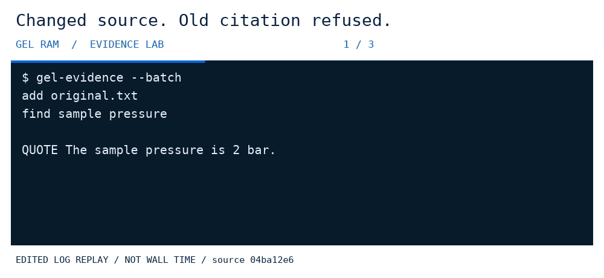</picture></a><p>Replace the source and inspect the refusal of the previous result.</p><p><a href="media/gifs/02-stale.txt">Transcript</a> · <a href="media/gifs/02-stale-dark.gif">Dark full size</a></p></td>
</tr>
<tr>
<td width="50%" valign="top"><picture><source media="(prefers-color-scheme: dark)" srcset="media/presentation/chips/03-dark.svg"></picture><h4>Backup. Inspect. Restore.</h4><a href="media/gifs/03-backup-light.gif"><picture><source media="(prefers-reduced-motion: reduce) and (prefers-color-scheme: dark)" srcset="media/gifs/03-backup-dark.png"><source media="(prefers-reduced-motion: reduce)" srcset="media/gifs/03-backup-light.png"><source media="(prefers-color-scheme: dark)" srcset="media/gifs/03-backup-dark.gif">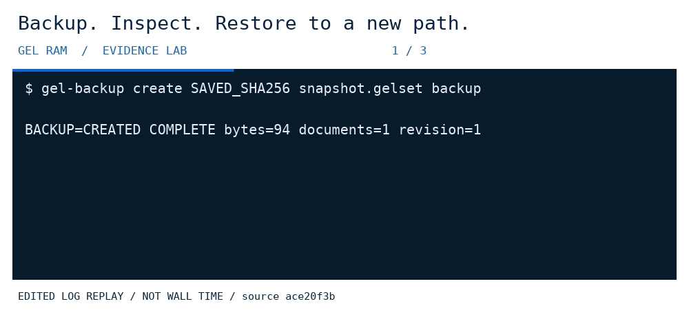</picture></a><p>Restore into a new path and check equality with the saved snapshot.</p><p><a href="media/gifs/03-backup.txt">Transcript</a> · <a href="media/gifs/03-backup-dark.gif">Dark full size</a></p></td>
<td width="50%" valign="top"><picture><source media="(prefers-color-scheme: dark)" srcset="media/presentation/chips/04-dark.svg"></picture><h4>One command. Inspect every result.</h4><a href="media/gifs/04-reproduce-light.gif"><picture><source media="(prefers-reduced-motion: reduce) and (prefers-color-scheme: dark)" srcset="media/gifs/04-reproduce-dark.png"><source media="(prefers-reduced-motion: reduce)" srcset="media/gifs/04-reproduce-light.png"><source media="(prefers-color-scheme: dark)" srcset="media/gifs/04-reproduce-dark.gif">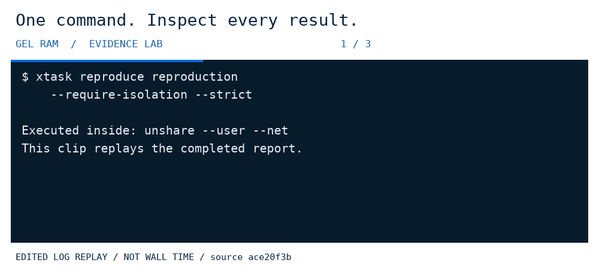</picture></a><p>Read the recorded strict reproduction result and its declared scope.</p><p><a href="media/gifs/04-reproduce.txt">Transcript</a> · <a href="media/gifs/04-reproduce-dark.gif">Dark full size</a></p></td>
</tr>
<tr>
<td width="50%" valign="top"><picture><source media="(prefers-color-scheme: dark)" srcset="media/presentation/chips/05-dark.svg"></picture><h4>Changed bytes. Retained pin. Refusal.</h4><a href="media/gifs/05-integrity-light.gif"><picture><source media="(prefers-reduced-motion: reduce) and (prefers-color-scheme: dark)" srcset="media/gifs/05-integrity-dark.png"><source media="(prefers-reduced-motion: reduce)" srcset="media/gifs/05-integrity-light.png"><source media="(prefers-color-scheme: dark)" srcset="media/gifs/05-integrity-dark.gif"></picture></a><p>A changed-byte copy is rejected against the original trusted hash.</p><p><a href="media/gifs/05-integrity.txt">Transcript</a> · <a href="media/gifs/05-integrity-dark.gif">Dark full size</a></p></td>
<td width="50%" valign="top"><picture><source media="(prefers-color-scheme: dark)" srcset="media/presentation/chips/06-dark.svg"></picture><h4>GEL and grep. Answers before speed.</h4><a href="media/gifs/06-compare-light.gif"><picture><source media="(prefers-reduced-motion: reduce) and (prefers-color-scheme: dark)" srcset="media/gifs/06-compare-dark.png"><source media="(prefers-reduced-motion: reduce)" srcset="media/gifs/06-compare-light.png"><source media="(prefers-color-scheme: dark)" srcset="media/gifs/06-compare-dark.gif">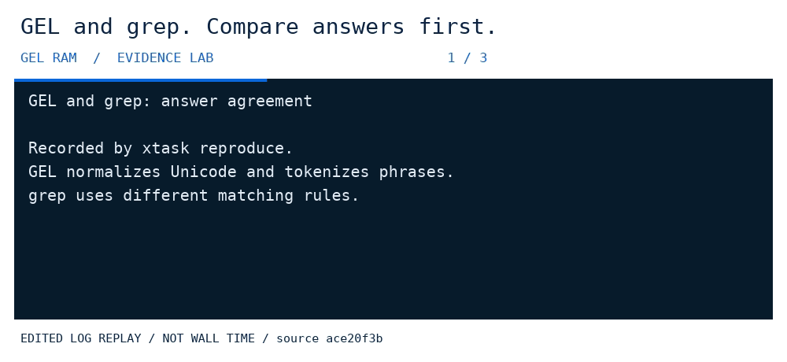</picture></a><p>See matching and differing answers. No universal speedup is claimed.</p><p><a href="media/gifs/06-compare.txt">Transcript</a> · <a href="media/gifs/06-compare-dark.gif">Dark full size</a></p></td>
</tr>
</table>


The earlier [70-second Evidence Lab film](media/GEL-EVIDENCE-LAB-EN.mp4),
its [original process logs](media/EVIDENCE-LAB-GUIDE.md) and
[open human review](docs/MEDIA-DECODE-REVIEW.md) remain separate historical material.
New presentation is not a new execution, benchmark or human acceptance.

## What the public checks cover

<picture><source media="(prefers-color-scheme: dark)" srcset="media/presentation/wall-dark.svg"></picture>

Each cell is one documented property on one CI platform. On every platform the
[CI evidence collector](docs/CI-EVIDENCE.md) withholds COMPLETE unless each test
named in the [property map](docs/PROPERTY-TESTS.md) ran and passed exactly once;
declared Unix-only tests are exempt on Windows. The image shows this rule, not
the outcome of one run: read that in the run's CI report.

<picture><source media="(prefers-color-scheme: dark)" srcset="media/presentation/bars-dark.svg"></picture>

Every mutant of the [format mutation matrix](docs/MUTATION-MATRIX.md) is read
twice: with the original pin, which must refuse any changed byte, and with a
recomputed pin, which lets the structural rules decide. The bars count the
committed report; `xtask verify` regenerates it and fails on any difference.
Both images are drawn from these files when the presentation is built, and the
read-only presentation check fails if they drift.

## What is different here

Three properties, each with its evidence and its limit:

- **It answers with a stored source passage or says UNKNOWN; it is not always
  right.** On the 80 frozen questions of question set v1 it gave 11 answers,
  all correct, and 69 UNKNOWN, where three
  language models answering closed book gave 11–28 wrong answers each. On 394
  new frozen questions it answered 63: 59 correct and 4 wrong, each a passage
  from another article; the models gave 80–233 wrong answers each. On 80
  questions without a correct answer it still answered 6 of the 40 with a false
  premise, so it does not always refuse. On 985 newer frozen questions, written
  after the change it tests, a development build answered 423: 405 correct and 18
  wrong; two BM25 search engines on the same bank found more (531–558 correct)
  and gave more wrong answers (40–41). On 987 more frozen questions the same
  build answered 432: 416 correct and 16 wrong, and the engines again found
  more (567–597 correct) with more wrong answers (43–47). On 990 further frozen
  questions it answered 465: 447 correct and 18 wrong; the engines found more
  (588–616 correct) with more wrong answers (33–36). On 982 more frozen questions
  it answered 425: 413 correct and 12 wrong; of 599 further questions whose answer
  is not in the bank, 399 about real topics outside it and 200 about invented
  subjects, it answered 26 and said UNKNOWN to 573. The engines at their strict
  threshold, with about as many wrong answers in all (34–38 against 38), gave
  380–384 correct answers.
  [Side by side](docs/GEL-BESIDE-GROQ.md) · [question set v2](docs/answer-or-abstain-v2/README.md) · [question set v4](docs/answer-or-abstain-v4/README.md) · [question set v5](docs/answer-or-abstain-v5/README.md) · [question set v6](docs/answer-or-abstain-v6/README.md) · [question set v7](docs/answer-or-abstain-v7/README.md) · [no-answer control](docs/GEL-BESIDE-GROQ-NO-ANSWER.md)
- **Knowledge is printed, not trained.** New knowledge is written into memory;
  no fine-tuning or LoRA run is involved. In the public tools this is the
  collection you build from your own files: add a document and cite it exactly;
  replace it and the old citation is refused.
- **Saved snapshots survive a killed process.** The public snapshot tools keep the previous
  copy through injected I/O failures, permission denial and a full disk
  ([fault tests](docs/PUBLICATION-FAULT-TESTS.md)), and a growing collection
  killed at random moments loses no acknowledged snapshot
  ([crash series](docs/CRASH-SERIES.md)). Power-loss durability is not
  established.

## What you can check without the private code

GEL's own answers come from a private implementation and its bank, so they
cannot be re-run from this checkout. Everything around them can:

| What | How | You need |
|:---|:---|:---|
| The public tools do what these pages say | `cargo run --locked --offline -p xtask -- verify` ends with `GEL_VERIFY_ALL=PASS` | this checkout, Rust 1.85.0 |
| No acknowledged snapshot is lost when the process is killed | `cargo run --locked --offline -p xtask -- crash-series` ends with `CRASH_SERIES=PASS` | this checkout on Linux or macOS |
| The scoring of every recorded answer, GEL's and the models' | `cargo run --locked --offline -p xtask -- answer-bench check` re-scores them under two rules and compares the published tables | this checkout |
| The language models' side of the comparisons | send the published questions and prompts to the same models, then score your answers with `answer-bench score` ([set and method](docs/answer-or-abstain/README.md)) | a free Groq account |
| That a private result was not changed after publication | each result lists the SHA-256 of its private evidence ([measured progress](docs/MEASURED-PROGRESS.md)); this shows tampering, it does not verify the result | nothing |

An independent run of the public tools on a second machine is still missing
([issue #20](https://github.com/Gelram-project/gel-ram/issues/20)).

## Measured GEL results — scope matters

> **PRIVATE MEASUREMENT — not runnable from this repository.** The GEL answers
> and timings in this section come from the separate private implementation and
> its private bank. What you can run yourself: the [public checks](#what-the-public-checks-cover)
> and a re-scoring of every recorded answer (`xtask answer-bench check`).

These are **author-run measurements of a separate private implementation**,
not benchmarks of this public checkout or an LLM leaderboard.
They are reported here without publishing the private engine.

| Operation | Observations | Measured result | What it establishes |
|:---|---:|:---|:---|
| Resident read at a known address | 40 | p50 **53.872 µs**, p95 **79.640 µs**, p99 **90.009 µs**; 40/40 reference matches | Addressed read after loading into RAM, not semantic search |
| Source-integrity gate | 1,000 source fragments; 5 controls each | **1,000 valid payloads admitted; 4,000 invalid cases rejected** | Changed payload, missing address, wrong source and stale catalog generation are distinguished |
| Single Q8 ranking | 400 source-text probes | top-1 **368/400 (92%)**; top-10 **393/400 (98.25%)** | Ranking within the known 250k-record slot |
| Quad ranking | Same 400 source-text probes | top-1 **310/400 (77.5%)**; top-10 **361/400 (90.25%)** | Same diagnostic task; Quad did not outperform Single in this run |

The logical ranking bank contains **1M fragments across four 250k slots**;
these probes do **not** search all 1M candidates. One empty probe remains in
the quality denominator. Integrity controls use a separate 1,000-fragment
PL/EN catalog, not the million-record bank. The gate is an experimental
CPU adapter, tested offline in a Linux sandbox, not a deployed service.

Percentiles use nearest-rank; with N=40, p99 is the maximum. These are
single-host diagnostic runs, not independently replicated measurements.
Matching source bytes does not establish truth or understanding.
Neither hardware-level memory computation nor a speedup over LLMs is
established by these tests.

The underlying logs and private harness remain outside this checkout.
**These rows are not independently reproducible from the public release.**
Public-tool demonstrations and their reproducible evidence above retain
their own, separate scope. No private version identifiers, source code,
knowledge banks or credentials are included here.

### New measurements: ranking improvement and source-field dialogue

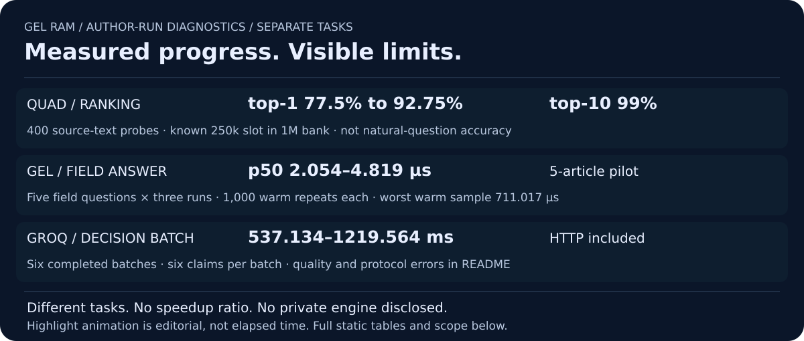

Animation highlights rows only; it is **not execution footage or a timing scale**.
All numbers remain visible, with a reduced-motion mode and the text table below.
These author-run private experiments do not change the public implementation.

| Experiment | Earlier result | Updated measurement | Scope |
|:---|:---|:---|:---|
| Quad top-1 | 310/400 (77.5%) | **371/400 (92.75%)** | Same 400 source-text probes; known 250k slot within a 1M bank |
| Quad top-10 | 361/400 (90.25%) | **396/400 (99%)** | Not natural-question accuracy or global 1M search |
| Single Q8 top-1 / top-10 | 368/400 / 393/400 | **379/400 / 397/400** | Single still outperforms Quad on this diagnostic |
| Source-field dialogue | Separate task | **p50 2.054–4.819 µs** across five field questions and three runs | Five articles in RAM; finished source-bound text, not a million-record search |
| Two-source whole-field comparison | Separate task | **p50 19.417–21.220 µs** across three runs | Exact field comparison, not unrestricted reasoning |
| Transfer to four new articles | No latency measurement | **6 source-field answers, 2 quotations, 1 limited comparison, 3 UNHANDLED, 1 UNKNOWN** | 13 PL questions; not 9/13 accuracy |

The timing pilot used 1,000 warm repetitions **per question per run**.
The slowest retained warm observation was **711.017 µs**; medians are not
worst-case guarantees. Newer quotation/list support was not timed in that
campaign. A quotation is not a verified semantic decision.

[All 13 timing rows, provenance and limitations](docs/MEASURED-PROGRESS.md).
The Groq table below remains a separate supplied-source decision diagnostic;
**no GEL/Groq speedup ratio follows from these different tasks**.

### Answer verdict: answer only when the lead is clear

Measured after the v0.5.0 release with the same private implementation as the
ranking rows above. The original column uses the same 1M bank. After the three
changes the searched answer bank holds 167,854 passages per slot, 671,416 in all;
to keep the slots equal, every slot was cut at its end to the size of the
smallest, which removed about a quarter of the English passages the changes left.
GEL answers only when its best passage leads the runner-up by a
threshold fixed in advance (set on a different corpus); otherwise it
returns UNKNOWN. Three changes to the private build were measured one at a time
(duplicate handling, answer-bank scope and an encoder variant); their details
remain private.

| Stored passages read back (ranked within their slot) | Original bank (1M passages) | After the three changes (671,416 passages) |
|:---|---:|---:|
| Probes | 9,998 | 50,000 |
| Answered | 7,693 (76.9%) | 46,376 (92.8%) |
| Correct (same article), share of the answers | 7,515 (97.7%) | **46,353 (99.95%)** |
| Wrong, share of all probes | 178 (1.78%) | **23 (0.046%)** |
| UNKNOWN | 2,305 (23.1%) | 3,624 (7.2%) |

Two of the four slots reach a 95% Wilson lower bound of at least 0.999 (0.9993
and 0.9994); the other two reach 0.9984 and 0.9986. The probes are stored
passages, not questions. Counts are exact; the original-bank row was earlier
given as 10,000 probes and 77.0% answered, where 2 empty probes are not counted
and 7,693 of 9,998 is 76.9%.

| 80 natural questions of question set v1 (40 PL, 40 EN), all four slots of the 671,416-passage bank searched | Without verification | With source verification |
|:---|---:|---:|
| Top-1 from the right article | 27 (34%) | **40 (50%)** |
| Answers given | 9 (1 wrong) | **11 (all correct)** |
| UNKNOWN | 71 | 69 |

The questions were written by the project's AI coding assistant for randomly
sampled passages and frozen before any run. Verification compares a question
with the stored sources of its best candidates; its threshold was set on a separate
calibration set of 80 questions. 11 of 11 has a 95% Wilson lower bound of about 0.74, so this is
not a precision claim. Answering natural questions remains the open problem: 14%
answered here, 43% (423 of 985) on the later [question set v4](docs/answer-or-abstain-v4/README.md),
44% (432 of 987) on [question set v5](docs/answer-or-abstain-v5/README.md), 47% (465 of 990) on
[question set v6](docs/answer-or-abstain-v6/README.md) and 43% (425 of 982) on
[question set v7](docs/answer-or-abstain-v7/README.md).

[Protocol, per-slot results and evidence identities](docs/MEASURED-PROGRESS.md).

### Side by side with three language models

The same 80 frozen questions (question set v1) went to GEL RAM and, closed book, to three
language models on the Groq API, in one recorded run with one scoring rule.
GEL answered 11 and said UNKNOWN to 69; **none of its answers was wrong**. The
models could also say UNKNOWN, yet **11–28 of their answers were wrong**.

| Same 80 questions | Answered | Correct | Wrong | UNKNOWN |
|:---|---:|---:|---:|---:|
| GEL RAM (local bank, answers with the source passage) | 11 | 11 | **0** | 69 |
| GPT-OSS-120B (Groq API, closed book) | 31 | 10 | 21 | 49 |
| GPT-OSS-20B (Groq API, closed book) | 36 | 8 | 28 | 44 |
| Qwen3.8-27B (Groq API, closed book) | 17 | 6 | 11 | 63 |

[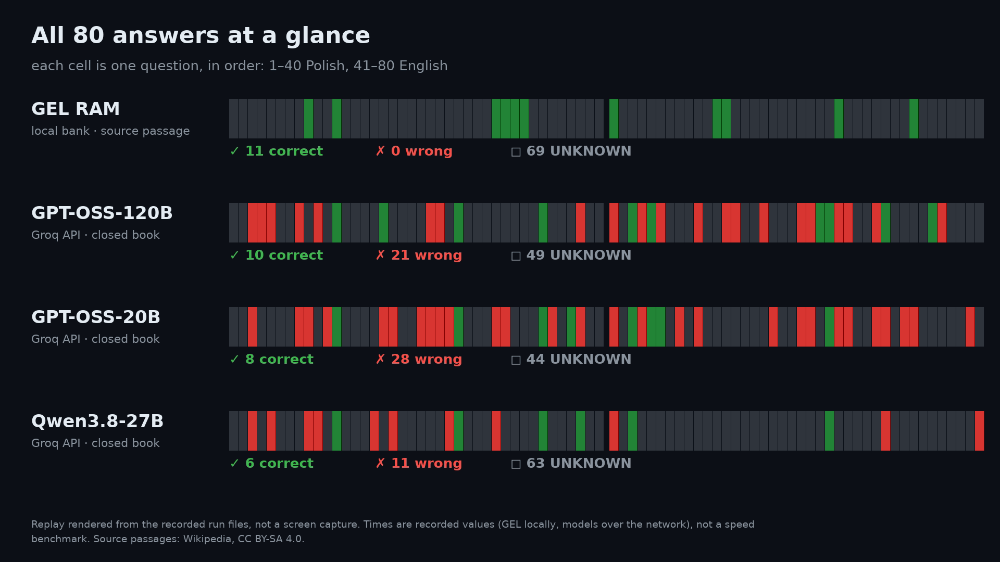](docs/GEL-BESIDE-GROQ.md)

The two sides do different jobs: GEL looks facts up in a bank it holds, the
models answer from training. On 10 of GEL's 11 answers no model was correct; on
12 other questions a model was correct where GEL said UNKNOWN. The visible model
answers were two words at the median; the GPT-OSS models also generated 51 and
154 hidden reasoning tokens per question on average. GEL returns the stored
source passage (33 words at the median). Times are recorded, not compared: GEL
0.25 s for all 80 locally, the models 59–371 ms per question at the median over
the network. [All 80 answers, times, prompts, review and limits](docs/GEL-BESIDE-GROQ.md)
· [Replay of every question (5 min)](media/beside-groq/GEL-BESIDE-GROQ-80-QUESTIONS-EN.mp4)
· [Try your own system on the same questions](docs/answer-or-abstain/README.md)

**No-answer control.** 80 more questions have no correct answer: 40 ask about
invented subjects, 40 carry a false premise about an entry in the bank. GEL
answered none of the invented ones and 6 of the false premises; it can still
return a passage that matches a question without answering it. The models
answered 3–22 and 2–16. [No-answer control](docs/GEL-BESIDE-GROQ-NO-ANSWER.md)

**A larger frozen question set (v2).** 394 new questions (198 PL, 196 EN), drawn at
random from the bank and frozen before any system ran, went to the same four
systems in one run on 2026-09-29. GEL answered 63 and said UNKNOWN to 331:
**59 correct and 4 wrong** — each wrong answer a passage from another article,
three of them disambiguation pages, all four in Polish. The models answered
123–283 and gave **80–233 wrong answers each**.

| Same 394 questions (question set v2) | Answered | Correct | Wrong | UNKNOWN |
|:---|---:|---:|---:|---:|
| GEL RAM (local bank, answers with the source passage) | 63 | 59 | **4** | 331 |
| GPT-OSS-120B (Groq API, closed book) | 223 | 92 | 131 | 171 |
| GPT-OSS-20B (Groq API, closed book) | 283 | 50 | 233 | 111 |
| Qwen3.8-27B (Groq API, closed book) | 123 | 43 | 80 | 271 |

[Question set v2: every question, answer and review decision](docs/answer-or-abstain-v2/README.md)

### Same supplied-source task: GEL adapter and models served by Groq

Twelve development claims (six PL, six EN), with the same supplied Wikipedia
passages and prompts. **One timed batch per language and profile**, not six
latency observations. Label agreement is separate from citation/format validity.

| System / profile | Language | Batch time | Labels matching working gold | Label + required structure | S/R decisions |
|:---|:---:|---:|---:|---:|---:|
| GEL bounded adapter R0 | PL | **85.851 µs** | 2/6 | 2/6 | **0/6** |
| GEL bounded adapter R0 | EN | **78.057 µs** | 2/6 | 2/6 | **0/6** |
| Groq / Qwen R0 | PL | 537.134 ms | 5/6 | 5/6 | 5/6 |
| Groq / Qwen R0 | EN | 552.672 ms | 6/6 | 6/6 | 4/6 |
| Groq / GPT-OSS-20B R1 | PL | 818.245 ms | 5/6 | 1/6 | 5/6 |
| Groq / GPT-OSS-20B R1 | EN | 879.478 ms | protocol rejected | 0/6 | 0/6 admitted |
| Groq / GPT-OSS-120B R1 | PL | 1219.564 ms | 5/6 | 5/6 | 5/6 |
| Groq / GPT-OSS-120B R1 | EN | 1035.560 ms | 6/6 | 1/6 | 4/6 |

**GEL returned UNKNOWN for every claim because the grammar was unsupported.**
Its microsecond times measure parsing and abstention, not successful semantic
decisions; the 2/6 agreement is the always-UNKNOWN baseline.
Groq times include HTTP/network and generation. There is **no justified
GEL/LLM speedup multiplier** here, and N=1 does not support latency percentiles.
The adapter is not a complete GEL application or an Ocean retrieval benchmark.

Earlier 20B and 120B PL attempts were incomplete at the 1024-token limit
(1383.914 ms and 2407.528 ms). They are retained in the
[protocol, exact times and failure notes](docs/GEL-GROQ-DIAGNOSTIC.md).
This small, development-exposed comparison is not independently validated
or a general model ranking. Private code, banks and API credentials stay private.

### What you can inspect

| Source-bound retrieval | Explicit failure states | Save and reopen |
|:---|:---|:---|
| Original UTF-8 quotations, document identifiers and byte ranges. | UNKNOWN is different from an incomplete search or an error. | Save to a new path and reopen with an independently retained SHA-256 pin. |
| [Readout contract](docs/DOCUMENT-READOUT.md) | [Batch schema and exit codes](docs/EVIDENCE-BATCH.md) | [Collection guide](docs/EVIDENCE-LAB.md) |

A citation check establishes correspondence to the retained source bytes.
**It does not establish that the source is true.** Search is bounded token-phrase
retrieval, not unrestricted question answering. Snapshots and backups contain
plaintext; hash verification is not encryption or a signature.

### Update, restart and reject a corrupted copy

<details>
<summary><strong>Open the recorded final screen and the executable scenario</strong></summary>

[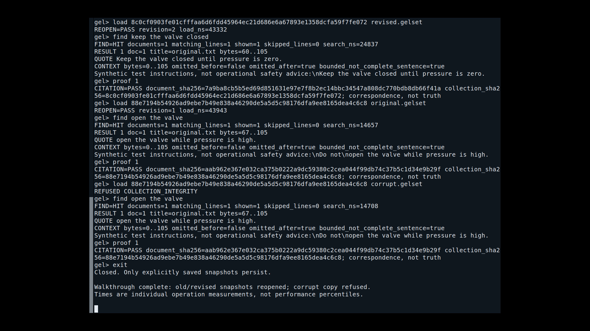](media/evidence-lab/03-update-restart-102s.png)

[Scenario, commands and checks](docs/UPDATE-RESTART-SCENARIO.md).
The still does not prove that every intermediate step was reviewed.

</details>

[All media and their scope](media/INDEX.md).
No generated terminal mockup or illustrative timing is used as execution evidence.

## Quick start

Use a new checkout. Install [Git](https://git-scm.com/) and [rustup](https://rustup.rs)
first. Cloning, toolchain installation and dependency fetching need a network;
the final command uses locked offline dependencies. Run each line separately,
including in Windows PowerShell.

```sh
git clone https://github.com/Gelram-project/gel-ram.git
cd gel-ram
git checkout v0.5.3
git rev-parse HEAD
rustup toolchain install 1.85.0 --profile minimal --component rustfmt --component clippy
cargo fetch --locked
cargo run --locked --offline --release -p gel-live-lab --bin gel-evidence -- --demo
```

Expected completion marker: `GEL_EVIDENCE_DEMO=PASS`.
This is an expected result to check, not a claim about a run you have not performed.

For the interactive prompt, run:

```sh
cargo run --locked --offline --release -p gel-live-lab --bin gel-evidence
```

Then enter these commands inside Evidence Lab:

```text
add crates/gel-source/fixtures/evidence-lab/memory.txt
find ram is volatile
proof 1
```

For your own UTF-8 files, use `add PATH`, `list`, `find PHRASE` and `proof 1`.
Use `save NEW_PATH`, retain the printed SHA-256 independently, exit, and reopen
with `load SHA256 PATH`. `replace ID PATH` and `drop ID` invalidate earlier
results. Nothing is uploaded or automatically saved by Evidence Lab.

[Full guide and limits](docs/EVIDENCE-LAB.md) · [More examples](docs/TRY-IT.md) ·
[Binary packaging and publication conditions](docs/BINARIES.md)

## Three practical workflows

| Goal | Public interface | Contract and evidence |
|:---|:---|:---|
| Integrate with scripts or CI | `gel-evidence --batch` produces JSON Lines, with separate status and diagnostic channels. | [Versioned schema, exit codes and limits](docs/EVIDENCE-BATCH.md) |
| Keep and recover a collection | `gel-backup` creates and inspects backups, restores to a new path and distinguishes withdrawal from deletion. | [Backup and restore](docs/BACKUP.md) |
| Challenge the parser | Run the finite format-mutation campaign against pinned fixtures. | [Mutation matrix and exclusions](docs/MUTATION-MATRIX.md) |

A missing committed backup manifest is not a complete backup. Restore must not
overwrite an existing snapshot. Directory durability is platform-specific;
`clear`, `drop`, withdrawal and file deletion do not erase all existing copies.
Read the backup contract before using these operations on important data.

## Reproduce the checks

After the quick-start setup, choose a new output directory outside the checkout:

```sh
cargo run --locked --offline -p xtask -- verify
cargo run --locked --offline -p xtask -- reproduce ../gel-repro-new
```

Expected markers include `GEL_VERIFY_ALL=PASS` and `REPRODUCTION=PASS` within
their declared scope. Read the report for failed, skipped and unmeasured steps;
a final marker is not proof of every feature or an independent second-host result.

Cargo's offline flag is not a system-wide network barrier. For the Linux
namespace procedure and `--require-isolation`, follow the
[reproduction guide](docs/REPRODUCE.md) and [isolation contract](docs/REPRODUCE-ISOLATED.md).
Windows and macOS limitations are recorded rather than counted as Linux checks.

[Per-platform CI evidence](docs/CI-EVIDENCE.md) · [Executable claim registry](docs/CLAIMS.md) ·
[Report an independent reproduction](https://github.com/Gelram-project/gel-ram/issues/new?template=reproduction.yml)

Reports and test data stay local unless you share them. Review paths, diagnostics
and source content before publishing a report. Keep slower runs and failures.

## Evidence, not a universal speed claim

| Evidence | What it establishes | Where to inspect it |
|:---|:---|:---|
| Public grep / SHA-256 comparison | A scoped comparison on a declared corpus, including cases where GEL is slower. Matching rules and timed work are not identical. | [Method, disagreement cases and raw results](docs/BENCHMARK-GREP.md) |
| Collection update measurements | Declared mutation-time and memory measurements, with measurement boundaries and exclusions. | [Mutation comparison](docs/MUTATION-COMPARISON.md) |
| F32, F16 and affine Q1 to Q16 reference | Separate byte, numerical-error and ranking checks on public fixtures. Not integration with every reader or private format. | [Precision matrix](docs/PRECISION-MATRIX.md) · [Codec scope](docs/CODEC-SCOPE.md) |
| Historical Ocean measurements | Author-reported CPU/RAM full scans; the research archive is not in this checkout. | [Historical results and limitations](docs/OCEAN-SCALE.md) |
| Author-reported GEL component measurements | Separate tasks whose private implementations cannot be reproduced from this repository. Not an end-to-end speedup over Ocean. | [Method and retained public observations](docs/GEL-EXPERIMENTAL-MEASUREMENTS.md) |

Do not divide timings from different tasks to claim a speedup. Numerical checks
are not semantic recall. Use the [measurement protocol](docs/MEASUREMENT-PROTOCOL.md)
and the [roadmap](docs/ROADMAP.md) to distinguish implemented checks, local
measurements, independent acceptance and open research.

<details>
<summary><strong>Explore the public numerical readout and source formats</strong></summary>

[Public architecture](docs/ARCHITECTURE.md) · [Q8 contract](docs/Q8-QUAD.md) ·
[Source readout](docs/SOURCE-READOUT.md) · [Multipart sources](docs/SOURCE-PARTS.md) ·
[Source building](docs/SOURCE-BUILDER.md) · [Storage format](docs/FORMAT.md)

The source panel and synthetic Q8 panel are separate. Four reversible coordinate
views are not four independent datasets; a Q label alone says nothing about
natural-language quality. The public numerical demonstration is available through:

```sh
cargo run --locked --offline --release -p gel-phase-quad --example quad_playground -- --interactive
```

[Illustrated guide](docs/ILLUSTRATED-GUIDE.md) ·
[Live Lab](docs/LIVE-LAB.md) · [Real-source fixture and provenance](docs/REAL-SOURCE-DEMO.md)

</details>

## Documentation

| Start and use | Inspect and reproduce | Project and history |
|:---|:---|:---|
| [Project map](docs/START-HERE.md) | [Verified results and scope](docs/VERIFIED-RESULTS.md) | [Public roadmap](docs/ROADMAP.md) |
| [Evidence Lab](docs/EVIDENCE-LAB.md) | [Publication fault tests](docs/PUBLICATION-FAULT-TESTS.md) | [Publication status](CANDIDATE-STATUS.md) |
| [Batch interface](docs/EVIDENCE-BATCH.md) | [Source bundle verification](docs/SOURCE-BUNDLE.md) | [Media index](media/INDEX.md) |
| [Backup / restore](docs/BACKUP.md) | [Dependency inventory](docs/DEPENDENCY-INVENTORY.md) | [Release notes](RELEASE-NOTES-v0.5.3.md) |

Earlier README versions and the notes of earlier releases are no longer kept in
the tree; they remain in the git history. Detailed reports and raw evidence
remain in their original locations.

## About and licensing

GEL RAM is an independent hobby and research project by RR, developed with AI
assistance. This public repository is not the complete private research system.

GEL RAM-owned material uses **GEL RAM Noncommercial Reciprocal License 1.0**.
It is source-available, not an OSI-approved open-source license. Noncommercial
use and non-production Evaluation are governed by that license; Monetized Use
requires a separate signed Commercial Agreement. This README adds no rights.

[LICENSE](LICENSE) · [Licensing guide](LICENSING.md) · [Commercial terms](COMMERCIAL-LICENSE.md) ·
[Third-party notices](THIRD-PARTY-NOTICES.md) · [Media rights](media/RIGHTS.md)

Third-party material retains its own terms, including the MIT-licensed Rust Book
fixture and the Wikipedia passages (CC BY-SA 4.0) quoted in the measurement sets.
Historical grants are not rewritten. The license texts in force are pinned in
[docs/LICENSE-PINS.md](docs/LICENSE-PINS.md).

[Contributing](CONTRIBUTING.md) · [Security reporting](SECURITY.md) · [CLA privacy](CLA-PRIVACY.md)

Public attribution: **RR — GEL RAM Project**. Contract and CLA enquiries use
`gelram.licensing@gmail.com`; completed agreements and personal records stay private.
