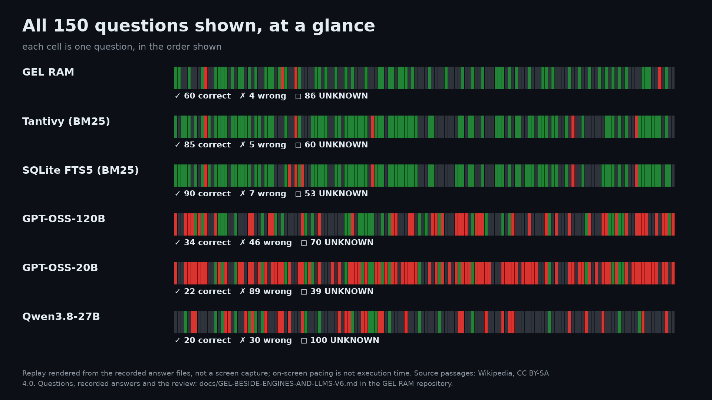

# GEL RAM beside two search engines and three language models — question set v6

> **Private measurement.** GEL RAM ran on the separate private implementation;
> this repository cannot run it. The search engines' and the models' answers are
> recorded, and the model side can be re-run by anyone with the prompts below.

400 questions of [question set v6](answer-or-abstain-v6/README.md) (200 Polish,
200 English), asked to three language models through the Groq API on
2026-10-05, beside the recorded answers of GEL RAM and of two BM25 search engines
on the same questions. A film shows 150 of them side by side; the claim registry
lists the result as `MEASURED_LOCAL`.

[](../media/beside-v6/GEL-BESIDE-ENGINES-AND-LLMS-V6-PART1-EN.mp4)

The film, 150 questions in two parts, 12 min in all:
[part 1, questions 1–75, 5 min 29 s](../media/beside-v6/GEL-BESIDE-ENGINES-AND-LLMS-V6-PART1-EN.mp4) ·
[part 2, questions 76–150 and the summary, 6 min 31 s](../media/beside-v6/GEL-BESIDE-ENGINES-AND-LLMS-V6-PART2-EN.mp4) ·
[summary only, 1 min 28 s](../media/beside-v6/GEL-BESIDE-ENGINES-AND-LLMS-V6-SUMMARY-EN.mp4).
All are replays rendered from the recorded answer files, not screen captures;
the on-screen pacing is not execution time.

**What this shows.** Not which side knows more. GEL RAM and the search engines
answer from the same bank of 671,416 Wikipedia passages; the models answer from
training, closed book. It shows what each does when it does not know the answer:
say so, or answer anyway.

## What was compared

- **The questions.** 400 of the 990 questions of set v6, drawn before any request
  by a fixed seed, 200 per language ([sample-400.txt](answer-or-abstain-v6/beside-llm/sample-400.txt)).
  The free tier of the API allows about 200,000 tokens per model per day, too few
  for all 990 questions in one run. The 150 questions in the film were drawn from
  the 400 by a second seed ([film-150.txt](answer-or-abstain-v6/beside-llm/film-150.txt)).
  None was picked by hand.
- **GEL RAM**, the development build measured in sets v4 to v6, at its balanced
  setting and its precise setting, both chosen on earlier questions. It answers
  with one stored passage, quoted as stored, or says UNKNOWN. Its answers are
  those recorded for set v6.
- **Tantivy and SQLite FTS5 (BM25)** over the same bank, at the thresholds chosen
  on earlier questions, as recorded for set v6.
- **GPT-OSS-120B, GPT-OSS-20B and Qwen3.8-27B** (`openai/gpt-oss-120b`,
  `openai/gpt-oss-20b`, `qwen/qwen3.8-27b`) through the Groq API, **closed book**:
  no passages and no tools. Temperature 0, at most 4096 output tokens, reasoning
  effort `low` for the GPT-OSS models, one question per request, 4 s apart. Three
  rate-limit replies (HTTP 429) were retried as allowed; every request completed.
  The three models ran at the same time, one run each.
- **One scoring rule for everyone**, as for the set: an answer is correct when it
  states the fact of the question's source passage; UNKNOWN is counted apart,
  never as wrong. The models' answers were reviewed blind to the systems: 583
  distinct question-answer pairs, 17 changes proposed and each checked against
  its row, 16 accepted (14 to CORRECT, mostly English names of Polish titles; 2 to
  WRONG) and 1 rejected ([review.txt](answer-or-abstain-v6/beside-llm/recorded/review.txt)).
  GEL RAM's and the engines' verdicts are those reviewed for set v6.

The English prompt, verbatim (SHA-256 `5880eedb…`; the Polish one,
`73204ceb…`, says the same and names Polish Wikipedia):

```text
Answer the question from your own knowledge. The question refers to a fact stated in an English Wikipedia article. Give one short answer (at most 12 words) and no explanation. If you are not sure of the answer, reply with exactly: UNKNOWN

Question: {PYTANIE}
```

## Results — the 400 questions

| System | Conditions | Answered | Correct | Wrong | UNKNOWN | Correct among answered (95% Wilson) |
|---|---|---:|---:|---:|---:|---|
| GEL RAM, balanced | local bank, one stored passage | 170 | 160 | 10 | 230 | 94.1% (89.5–96.8%) |
| GEL RAM, precise | the same, stricter setting | 114 | 112 | 2 | 286 | 98.2% (93.8–99.5%) |
| Tantivy (BM25) | same bank, same rule | 239 | 226 | 13 | 161 | 94.6% (90.9–96.8%) |
| SQLite FTS5 (BM25) | same bank, same rule | 253 | 239 | 14 | 147 | 94.5% (90.9–96.7%) |
| GPT-OSS-120B | Groq API, closed book | 218 | 89 | 129 | 182 | 40.8% (34.5–47.5%) |
| GPT-OSS-20B | Groq API, closed book | 276 | 46 | 230 | 124 | 16.7% (12.7–21.5%) |
| Qwen3.8-27B | Groq API, closed book | 130 | 33 | 97 | 270 | 25.4% (18.7–33.5%) |

Before the review the models had 82, 43 and 30 correct answers (136, 233 and 100
wrong).

| System | Polish: correct / wrong / UNKNOWN | English: correct / wrong / UNKNOWN |
|---|---|---|
| GEL RAM, balanced | 94 / 7 / 99 | 66 / 3 / 131 |
| GEL RAM, precise | 68 / 2 / 130 | 44 / 0 / 156 |
| Tantivy (BM25) | 131 / 8 / 61 | 95 / 5 / 100 |
| SQLite FTS5 (BM25) | 135 / 10 / 55 | 104 / 4 / 92 |
| GPT-OSS-120B | 48 / 58 / 94 | 41 / 71 / 88 |
| GPT-OSS-20B | 25 / 118 / 57 | 21 / 112 / 67 |
| Qwen3.8-27B | 24 / 70 / 106 | 9 / 27 / 164 |

Question by question, GEL RAM (balanced) beside each other system. p is the
two-sided exact sign test on the questions only one of the two answered
correctly (or wrongly):

| Other system | Correct only in GEL RAM / only in the other | Wrong only in GEL RAM / only in the other |
|---|---:|---:|
| Tantivy (BM25) | 16 / 82 (p < 0.001) | 6 / 9 (p = 0.607) |
| SQLite FTS5 (BM25) | 14 / 93 (p < 0.001) | 6 / 10 (p = 0.454) |
| GPT-OSS-120B | 133 / 62 (p < 0.001) | 6 / 125 (p < 0.001) |
| GPT-OSS-20B | 141 / 27 (p < 0.001) | 4 / 224 (p < 0.001) |
| Qwen3.8-27B | 149 / 22 (p < 0.001) | 7 / 94 (p < 0.001) |

What stands out:

- **Without the bank, the models are wrong far more often than right.** They
  were allowed to say UNKNOWN, yet 97–230 of their answers were wrong: 59–83% of
  what each answered. GEL RAM was wrong 10 times, at its precise setting twice.
- **The search engines find more answers than GEL RAM** from the same bank
  (82 and 93 questions only they answered correctly, against 16 and 14). On these
  400 questions their wrong answers do not differ from GEL RAM's beyond chance.
  On all 990 questions of the set, GEL RAM was wrong where they were not on 11 and
  10 questions, they where it was not on 26 and 28 (p = 0.020 and p = 0.005);
  see [set v6](answer-or-abstain-v6/README.md).
- **The two kinds of system know different questions.** GEL RAM answered
  correctly 133–149 questions that a given model did not; each model answered
  correctly 22–62 that GEL RAM did not.

## Limits

- The questions and both reviews were made by the project's AI coding assistant;
  this is not an independent benchmark.
- GEL RAM's answers come from a private development build, not a release. The
  set was used internally before its recorded runs without changing any build or
  setting, so GEL RAM's results on it were known ([set v6](answer-or-abstain-v6/README.md)).
- The models are closed book: this compares conditions, not models. A model
  given the bank's passages would be a different comparison.
- The engines run with default settings; a tuned setup may do better.
- 400 questions, one run per system. Times are not compared: GEL RAM and the
  engines ran locally, the models over the network.

## Re-scoring

The recorded model answers are
[gpt-oss-120b.txt](answer-or-abstain-v6/beside-llm/recorded/gpt-oss-120b.txt),
[gpt-oss-20b.txt](answer-or-abstain-v6/beside-llm/recorded/gpt-oss-20b.txt) and
[qwen3.8-27b.txt](answer-or-abstain-v6/beside-llm/recorded/qwen3.8-27b.txt), one
line per question: the question number in set v6, the answer as returned. To score one with the
set's rules, write a file of 990 lines with `UNKNOWN` for the questions outside
the sample and run:

```text
cargo run --locked --offline -p xtask -- answer-bench score v6:with-answer my-answers.txt
```

The correct and wrong counts printed are those of the sample before the review
above (for Qwen3.8-27B the strict rules count one more answer as wrong). Source
passages and expected answers quote Wikipedia under
[CC BY-SA 4.0](https://creativecommons.org/licenses/by-sa/4.0/); the models'
answers are reproduced as returned.
