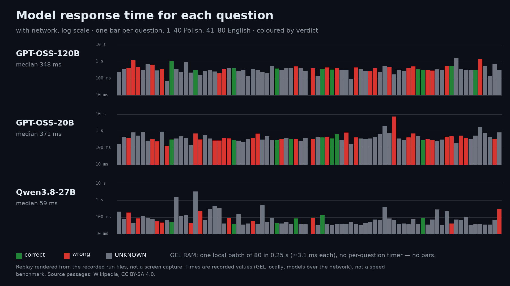
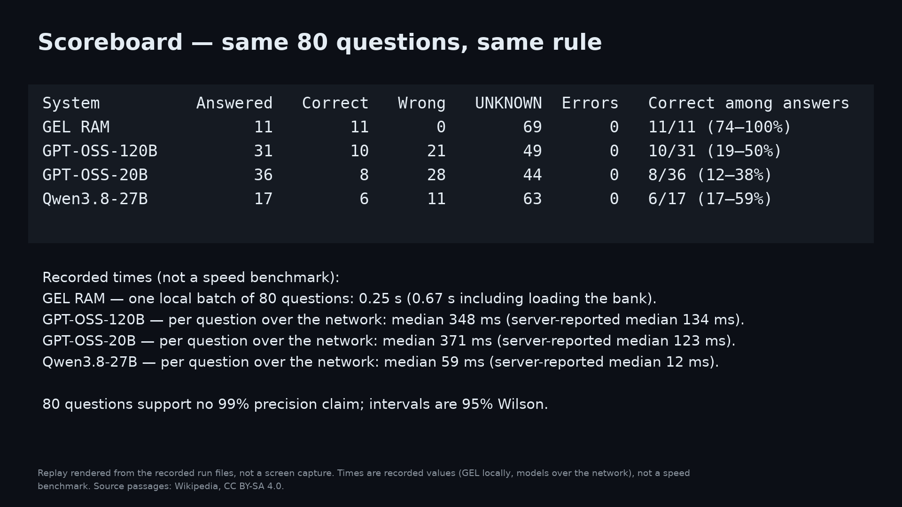

# GEL RAM beside three language models — 80 frozen questions

> **Private measurement.** GEL RAM ran on the separate private implementation;
> this repository cannot run it on these questions. The recorded answers can be
> re-scored with `xtask answer-bench check`.

Recorded on 2026-09-28 in one run. Author-run: the GEL implementation and its
bank are private, and the model calls need a Groq account, so this cannot be
re-run from this checkout. The [claim registry](CLAIMS.md) lists it as
`MEASURED_LOCAL`.

**What this shows.** Not which side knows more: GEL looks facts up in a bank it
holds, the models answer from training. It shows what each does when it does
not know the answer: say so, or answer anyway. **The model side can be re-run
by anyone:** the questions, prompts and settings are below, and
`answer-bench score` scores your own answers with the same rule
([set and method](answer-or-abstain/README.md)). GEL's side is recorded.

**A larger frozen set.** On 2026-09-29 the same four systems answered 394 new
frozen questions in one run: GEL 59 correct and 4 wrong of 63 answers, the
models 80–233 wrong answers each. [Set v2](answer-or-abstain-v2/README.md).

[](../media/beside-groq/GEL-BESIDE-GROQ-80-QUESTIONS-EN.mp4)

## What was compared

- **The same 80 questions** (40 Polish, 40 English), written in natural language
  for 80 passages drawn at random from the GEL bank of about one million
  Wikipedia passages. Questions, expected answers, prompts and the protocol were
  frozen by SHA-256 before any model was called.
- **GEL RAM** answers from its local bank. When its best passage clearly leads,
  it returns that source passage; otherwise it says UNKNOWN. Same configuration
  as the [natural-question result](MEASURED-PROGRESS.md#natural-questions-on-the-final-answer-bank),
  re-run in the same session with byte-identical output.
- **GPT-OSS-120B, GPT-OSS-20B and Qwen3.8-27B** (`openai/gpt-oss-120b`,
  `openai/gpt-oss-20b`, `qwen/qwen3.8-27b`) were called through the Groq API
  **closed book**: no passages and no tools. Temperature 0, at most 4096 output
  tokens, reasoning effort `low` for the GPT-OSS models, one question per
  request, 4 s between requests. Rate-limit replies (HTTP 429, seven for Qwen)
  were retried as the protocol allowed; waiting time is not in the timings.
- **One scoring rule for everyone.** An answer is correct when it contains the
  fact stated in the question's source passage. Accepted spellings were written
  from the passage before the run; for list questions one listed item is
  enough. Anything else is wrong. UNKNOWN is counted separately, never as wrong.
  A manual review, whose two permitted corrections were fixed in the protocol,
  changed two verdicts; both are listed below.

The English prompt, verbatim (the Polish one says the same and names Polish
Wikipedia):

```text
Answer the question from your own knowledge. The question refers to a fact stated in an English Wikipedia article. Give one short answer (at most 12 words) and no explanation. If you are not sure of the answer, reply with exactly: UNKNOWN

Question: {question}
```

## Results

| System | Conditions | Answered | Correct | Wrong | UNKNOWN | Errors | Correct among answers (95% Wilson) |
|---|---|---:|---:|---:|---:|---:|---|
| GEL RAM | local bank, answers with a source passage | 11 | 11 | 0 | 69 | 0 | 11/11 (74–100%) |
| GPT-OSS-120B | Groq API, closed book | 31 | 10 | 21 | 49 | 0 | 10/31 (19–50%) |
| GPT-OSS-20B | Groq API, closed book | 36 | 8 | 28 | 44 | 0 | 8/36 (12–38%) |
| Qwen3.8-27B | Groq API, closed book | 17 | 6 | 11 | 63 | 0 | 6/17 (17–59%) |

| System | PL: correct / wrong / UNKNOWN | EN: correct / wrong / UNKNOWN |
|---|---|---|
| GEL RAM | 6 / 0 / 34 | 5 / 0 / 35 |
| GPT-OSS-120B | 4 / 8 / 28 | 6 / 13 / 21 |
| GPT-OSS-20B | 4 / 14 / 22 | 4 / 14 / 22 |
| Qwen3.8-27B | 4 / 8 / 28 | 2 / 3 / 35 |

What stands out:

- **GEL gave no wrong answer.** The models were also allowed to say UNKNOWN,
  yet 11–28 of their answers were wrong: 65–78% of what each model answered.
- **The two sides knew different questions.** On 10 of the 11 questions GEL
  answered, no model was correct. On question 41 all three models gave the same
  wrong reason (the MP died); the source says John Hare was elevated to the
  House of Lords.
- **The models knew facts GEL did not find.** On 12 questions at least one model
  was correct where GEL said UNKNOWN. Answering only 11 of 80 remains GEL's open
  problem.
- **Recorded times, not a race.** GEL answered the 80 questions locally in one
  batch of 0.25 s (0.67 s including loading the bank). Over the network the
  median time per question was 348 ms (GPT-OSS-120B), 371 ms (GPT-OSS-20B) and
  59 ms (Qwen3.8-27B); the server-reported medians were 134, 123 and 12 ms.

### Manual review

| Model | Question | Automatic | Reviewed | Reason |
|---|---:|---|---|---|
| GPT-OSS-120B | 38 | correct | wrong | Only the generic word "well" matched; the answer names Beersheba, the source names Beer-lahai-roi |
| Qwen3.8-27B | 25 | wrong | correct | "Victoria" is the short name of Victoria Peak, one of the two summits the source names |

Automatic totals: GPT-OSS-120B 11 correct / 20 wrong, Qwen3.8-27B 5 correct /
12 wrong; the others are unchanged. No new rule was added after the run, so
some answers stay wrong although they are not simply false:

- true but less specific than the source: GPT-OSS-20B "Los Angeles" for Century
  City (question 29) and "1923" for 19 April (question 65);
- a different fact that other sources give: GPT-OSS-120B derives the name
  Abelard from Adalhard (question 3), and both GPT-OSS models name Rochester
  instead of Berwick (question 61).

Counting none of these as wrong would still leave 19, 25 and 11 wrong answers.

## Response time and answer length

| System | Time per question | Server-reported (median) | Answer length in words (median / max) | Output tokens per question (mean) | Of which hidden reasoning (mean) |
|---|---|---:|---|---:|---:|
| GEL RAM | 3.1 ms on average (one local batch of 80: 0.25 s; no per-question timer) | — | source passage: 33 / 81 | 0 (returns stored text) | 0 |
| GPT-OSS-120B | median 348 ms, mean 417 ms, max 1756 ms (with network) | 134 ms | 2 / 8 | 64 | 51 |
| GPT-OSS-20B | median 371 ms, mean 547 ms, max 7345 ms (with network) | 123 ms | 2 / 11 | 167 | 154 |
| Qwen3.8-27B | median 59 ms, mean 161 ms, max 3506 ms (with network) | 12 ms | 2 / 8 | 3 | not reported |

| Mean per question, by verdict | Correct | Wrong | UNKNOWN |
|---|---|---|---|
| GPT-OSS-120B | 448 ms · 58 tokens (44 reasoning) · n=10 | 514 ms · 101 tokens (84 reasoning) · n=21 | 369 ms · 49 tokens (39 reasoning) · n=49 |
| GPT-OSS-20B | 374 ms · 68 tokens (50 reasoning) · n=8 | 666 ms · 127 tokens (112 reasoning) · n=28 | 503 ms · 209 tokens (199 reasoning) · n=44 |
| Qwen3.8-27B | 74 ms · 6 tokens · n=6 | 114 ms · 8 tokens · n=11 | 177 ms · 2 tokens · n=63 |


- The visible model answers are short: two words at the median for every
  model. Before answering, the GPT-OSS models also generate hidden reasoning:
  on average 51 (120B) and 154 (20B) of their output tokens per question.
  Qwen3.8-27B reports no reasoning tokens.
- GPT-OSS-120B spent about twice as many tokens on its wrong answers (101 on
  average) as on its correct ones (58), and the wrong answers took longer. GPT-OSS-20B
  spent the most on the questions it answered UNKNOWN (209 tokens on average).
- GEL generates no text. It returns the stored source passage (33 words at the
  median, 81 at most), so the reader sees where the answer comes from. GEL has no
  per-question timer; 3.1 ms is the average of one local batch of 80 questions.
- Model times include the network and were taken one question per request; GEL
  ran locally in one batch. They are recorded values, not a speed comparison.




## Films

- [All 80 questions, side by side (5 min 27 s)](../media/beside-groq/GEL-BESIDE-GROQ-80-QUESTIONS-EN.mp4)
- [Summary (48 s)](../media/beside-groq/GEL-BESIDE-GROQ-SUMMARY-EN.mp4)

Both are silent 1920×1080 replays rendered from the recorded run files, not
screen captures. Every question, answer, verdict and time on screen comes from
those files; the pacing (3.5 s per question) is not execution time. Each question
frame also shows the answer length, the output tokens and the time.



## What this shows — and what it does not

- The two sides do different jobs. GEL looks facts up in a collection it holds;
  the models answer from what they learned in training. This is not a
  retrieval-augmented setup and not a comparison of engines.
- Several questions are underspecified without the collection ("the choir", "the
  company", "the regiment"). For a closed-book model UNKNOWN is the right reply.
- The questions and expected answers were written by the project's AI coding
  assistant for passages in the bank; they were not written or reviewed
  independently. GEL returns stored passages, so its correct answers measure
  whether it chose the right passage.
- Eighty questions give wide intervals. No 99% precision is claimed for anyone.
- Times are recorded values under different conditions: GEL ran locally in one
  batch, the models were called over the network one question at a time. They
  are not a speed comparison.
- A [no-answer control](GEL-BESIDE-GROQ-NO-ANSWER.md) asks 80 questions that have no
  correct answer: GEL answered none of 40 invented subjects and 6 of 40 false
  premises.
- Not claimed: general question answering, semantic understanding, superiority
  over language models, or a speed advantage.

## Evidence

The questions, accepted spellings and recorded answers are also in the
[answer-or-abstain set](answer-or-abstain/README.md), with a scorer for other
systems.

The full record — question, expected answer, GEL verdict with the source
excerpt and passage length, and each model's verdict, answer, time, server time,
output and reasoning tokens and answer length — is
[side-by-side.txt](evidence-side-by-side/side-by-side.txt) (tab-separated).
Raw requests and responses are retained privately; the SHA-256 values identify
them but do not make them reproducible from this checkout.

| Artifact | SHA-256 |
|---|---|
| Questions (frozen) | 9a1b13450bb4767bfdb43071d00ed0506e0a7ca718fb780b41c5ee35bb103e4a |
| Expected answers and accepted spellings (frozen) | 81e1d75dfe2358eda4c4d59ad46a660422b53cf08364c43d8592f663d071d670 |
| Polish prompt | 73204ceb1635449a5a3a8bd2db657eb33744174f484c1c37b818db9a3f1605dd |
| English prompt | 5880eedb70c87a34565bda47fd7c542036edf0f3e1ee8b170136f03a1316c705 |
| Protocol (private, frozen before the run) | 44f93b01b809f351c47c2e2019b124472a2d88e4f83820f9c71279e0d5e6cec0 |
| GEL output | 50714466b576a525a4627b24165740bbc1734d5bff9ab1710e5fd6fc6469797e |
| GPT-OSS-120B answers | 24b78585cb745cf24769984abb04f96dfa2696b23cf0eeb4be99419fd7cc4c93 |
| GPT-OSS-20B answers | de737ee6ed27ba66e70fdb5d54629753d128c487a27a5c57d11f0efc1ae28824 |
| Qwen3.8-27B answers | 8967431a606a615ca9c0ab2a504a0b256e1e9a2f10d3074ce29e5dc93bf4a983 |
| Automatic scoring | 96efd5054d8b0601f6af9a4d69a70ab921fc847c2ff22e43fcf298b0e4f093df |
| Manual review | 0256bc78aa9c5a90037703ae1511efdfc966669f38e7cb99c20dc28f6626046d |
| Reviewed scoring | 77cb7c0654b3e86419761a8ab7f043964056f3fd7d2537f05ca900e5ea3c1762 |

Source passages quoted here and in the films are from Wikipedia and are
available under [CC BY-SA 4.0](https://creativecommons.org/licenses/by-sa/4.0/);
the questions paraphrase them. Model answers are reproduced as returned.

## All 80 questions

✅ correct · ❌ wrong · ◻️ UNKNOWN · ⚠️ technical error. GEL cells quote the returned source passage around the expected answer and give the passage length; model cells give the time with network and the output tokens, hidden reasoning included.

| # | Question | Expected (from the source) | GEL RAM | GPT-OSS-120B | GPT-OSS-20B | Qwen3.8-27B |
|---:|---|---|---|---|---|---|
| 1 | Którzy znani dziennikarze odeszli z Polskiego Radia, gdy słuchalność spadła do rekordowo niskiego poziomu? | Hirek Wrona, Artur Andrus, Wojciech Mann, Marcin Kydryński, Marek Niedźwiecki | ◻️ UNKNOWN | ◻️ UNKNOWN <sub>243 ms · 54 tok.</sub> | ◻️ UNKNOWN <sub>175 ms · 90 tok.</sub> | ◻️ UNKNOWN <sub>223 ms · 2 tok.</sub> |
| 2 | Kto skomponował muzykę do filmu „Święte serce”? | Andrea Guerra | ◻️ UNKNOWN | ◻️ UNKNOWN <sub>371 ms · 67 tok.</sub> | ◻️ UNKNOWN <sub>452 ms · 203 tok.</sub> | ◻️ UNKNOWN <sub>80 ms · 2 tok.</sub> |
| 3 | Od jakiego słowa pochodzi imię Abelard i co ono oznaczało? | prowansalskie „abelha” – „pszczelarz” | ◻️ UNKNOWN | ❌ Od imienia Adalhard, oznaczającego „szlachetny, mocny”. <sub>436 ms · 88 tok.</sub> | ❌ Abel – „oddech, para” (z hebrajskiego słowa oznaczającego „oddech”). <sub>391 ms · 70 tok.</sub> | ❌ Od hebrajskiego abel, co oznaczało „dym”. <sub>187 ms · 16 tok.</sub> |
| 4 | W którym klubie zaczynał karierę brazylijski piłkarz, który potem grał w Botafogo i Kashimie Antlers? | Goiás EC | ◻️ UNKNOWN | ❌ Botafogo. <sub>1258 ms · 258 tok.</sub> | ◻️ UNKNOWN <sub>851 ms · 501 tok.</sub> | ◻️ UNKNOWN <sub>44 ms · 2 tok.</sub> |
| 5 | Czym jest blasteza w geologii? | krystalizacja lub rekrystalizacja skał w stanie stałym | ◻️ UNKNOWN | ❌ Rodzaj brekcji – skała z ostrych, zrośniętych fragmentów. <sub>470 ms · 81 tok.</sub> | ◻️ UNKNOWN <sub>553 ms · 80 tok.</sub> | ❌ Blasteza to szczelina w skale wypełniona krzemieniem. <sub>84 ms · 18 tok.</sub> |
| 6 | Jak długo trwa utwór „Julia” na płycie z piosenką „Sexcrime (Nineteen Eighty-Four)”? | 6:40 | ◻️ UNKNOWN | ◻️ UNKNOWN <sub>311 ms · 32 tok.</sub> | ◻️ UNKNOWN <sub>914 ms · 616 tok.</sub> | ◻️ UNKNOWN <sub>118 ms · 2 tok.</sub> |
| 7 | Ile punktów zdobył Appelman w meczu z 10 lutego 2011 roku? | 9 | ◻️ UNKNOWN | ◻️ UNKNOWN <sub>728 ms · 16 tok.</sub> | ◻️ UNKNOWN <sub>277 ms · 68 tok.</sub> | ◻️ UNKNOWN <sub>92 ms · 2 tok.</sub> |
| 8 | Ile meczów w reprezentacji Albanii rozegrał piłkarz, który grał w Liteksie i APOEL-u? | 68 | ◻️ UNKNOWN | ❌ 78 <sub>643 ms · 178 tok.</sub> | ❌ 30 <sub>359 ms · 70 tok.</sub> | ◻️ UNKNOWN <sub>77 ms · 2 tok.</sub> |
| 9 | W jakim powiecie leży gmina Altenglan? | powiat Kusel | ✅ “…Nadrenia-Palatynat, w powiecie Kusel Altenglan – dawna gmina związkowa w kraju…” <sub>30 words</sub> | ◻️ UNKNOWN <sub>308 ms · 25 tok.</sub> | ❌ Kreis Bad Dürkheim. <sub>247 ms · 52 tok.</sub> | ❌ Powiat Bad Dürkheim <sub>57 ms · 7 tok.</sub> |
| 10 | Kto zagrał Grendela w filmie o Beowulfie z Gerardem Butlerem? | Ingvar Eggert Sigurðsson | ◻️ UNKNOWN | ❌ Robin Atkin Downes <sub>384 ms · 67 tok.</sub> | ◻️ UNKNOWN <sub>956 ms · 761 tok.</sub> | ❌ Ralph Fiennes <sub>47 ms · 5 tok.</sub> |
| 11 | Z jakim wynikiem Phil Taylor pokonał Andy'ego Jenkinsa w drugiej rundzie? | 3:0 | ◻️ UNKNOWN | ◻️ UNKNOWN <sub>70 ms · 16 tok.</sub> | ❌ 6-0 <sub>136 ms · 61 tok.</sub> | ◻️ UNKNOWN <sub>67 ms · 2 tok.</sub> |
| 12 | Z jakich białek składa się aktomiozyna? | aktyna i miozyna | ✅ “…w wodzie kompleks dwóch białek: aktyny i miozyny. Powstaje w czasie skurczu mięśnia,…” <sub>27 words</sub> | ✅ actin i myosin <sub>1073 ms · 38 tok.</sub> | ✅ Actomyosin consists of actin and myosin proteins. <sub>314 ms · 41 tok.</sub> | ✅ Aktyny i miozyny <sub>51 ms · 7 tok.</sub> |
| 13 | Gdzie urodził się Andrzej Krzysztof Łuczak i jakie muzeum założył? | Łódź; Muzeum im. Leokadii Marciniak | ◻️ UNKNOWN | ◻️ UNKNOWN <sub>386 ms · 56 tok.</sub> | ◻️ UNKNOWN <sub>371 ms · 113 tok.</sub> | ◻️ UNKNOWN <sub>1631 ms · 2 tok.</sub> |
| 14 | Za jaki film przyznano nagrodę za scenariusz na Lubuskim Lecie Filmowym w Łagowie w 1973 roku? | „Wesele” | ◻️ UNKNOWN | ◻️ UNKNOWN <sub>234 ms · 79 tok.</sub> | ◻️ UNKNOWN <sub>489 ms · 176 tok.</sub> | ◻️ UNKNOWN <sub>124 ms · 2 tok.</sub> |
| 15 | Kiedy i gdzie po raz pierwszy stwierdzono A. conica w Europie? | 2003, okolice Padwy | ◻️ UNKNOWN | ◻️ UNKNOWN <sub>963 ms · 48 tok.</sub> | ◻️ UNKNOWN <sub>407 ms · 104 tok.</sub> | ◻️ UNKNOWN <sub>144 ms · 2 tok.</sub> |
| 16 | W jakim biurze zaprojektowano okręty typu 209/1200, takie jak „San Luis”? | Ingenieurkontor Lübeck | ◻️ UNKNOWN | ◻️ UNKNOWN <sub>224 ms · 89 tok.</sub> | ◻️ UNKNOWN <sub>145 ms · 98 tok.</sub> | ❌ Lürssen <sub>44 ms · 4 tok.</sub> |
| 17 | W którym roku wybudowano nowy budynek WTC7? | 2006 | ◻️ UNKNOWN | ✅ 2006 <sub>324 ms · 38 tok.</sub> | ❌ 2001 <sub>722 ms · 94 tok.</sub> | ◻️ UNKNOWN <sub>3506 ms · 2 tok.</sub> |
| 18 | W którym roku Łukasiewicz uprościł aksjomat Nicoda? | 1925 | ◻️ UNKNOWN | ◻️ UNKNOWN <sub>173 ms · 63 tok.</sub> | ❌ 1920 <sub>311 ms · 83 tok.</sub> | ❌ 1930 <sub>235 ms · 5 tok.</sub> |
| 19 | Kto dostał nagrodę za rolę kobiecą w sekcji „Un Certain Regard”? | Dorotheea Petre | ◻️ UNKNOWN | ◻️ UNKNOWN <sub>274 ms · 16 tok.</sub> | ◻️ UNKNOWN <sub>608 ms · 151 tok.</sub> | ◻️ UNKNOWN <sub>70 ms · 2 tok.</sub> |
| 20 | Jak nazywa się praca przedstawiająca sprzedawcę herbaty z Kairu? | The Tea Seller (Souvenir of Cairo, 1862) | ◻️ UNKNOWN | ◻️ UNKNOWN <sub>319 ms · 30 tok.</sub> | ◻️ UNKNOWN <sub>363 ms · 116 tok.</sub> | ◻️ UNKNOWN <sub>322 ms · 2 tok.</sub> |
| 21 | Z jakim wynikiem dwumeczu zakończyła się rywalizacja z CD Primeiro de Agosto w Pucharze Zdobywców Pucharów w 1991 roku? | 1–9 | ◻️ UNKNOWN | ◻️ UNKNOWN <sub>267 ms · 22 tok.</sub> | ❌ 3-2 aggregate. <sub>270 ms · 57 tok.</sub> | ◻️ UNKNOWN <sub>490 ms · 2 tok.</sub> |
| 22 | Ilu zabitych i rannych stracili Niemcy w drugiej bitwie pod Narwikiem? | 128 zabitych, 67 rannych | ◻️ UNKNOWN | ❌ 0 zabitych, 2 rannych. <sub>201 ms · 76 tok.</sub> | ❌ 1,000 zabitych i 2,000 rannych. <sub>277 ms · 71 tok.</sub> | ◻️ UNKNOWN <sub>358 ms · 2 tok.</sub> |
| 23 | Kto zastąpił Imre Senkeya na stanowisku trenera Romy w sezonie 1947/1948? | Luigi Brunella | ◻️ UNKNOWN | ❌ Józef Kałuża. <sub>385 ms · 55 tok.</sub> | ❌ Giuseppe Viani. <sub>383 ms · 107 tok.</sub> | ◻️ UNKNOWN <sub>43 ms · 2 tok.</sub> |
| 24 | Kto śpiewał piosenkę „Syberiada polska” do filmu o tym samym tytule? | Anna Wyszkoni i Piotr Cugowski | ◻️ UNKNOWN | ◻️ UNKNOWN <sub>414 ms · 70 tok.</sub> | ❌ Czesław Niemen. <sub>364 ms · 117 tok.</sub> | ❌ Zbigniew Wodecki <sub>87 ms · 8 tok.</sub> |
| 25 | Jaki jest najwyższy szczyt Belize? | Victoria Peak lub Doyle’s Delight | ◻️ UNKNOWN | ✅ Doyle’s Delight. <sub>404 ms · 55 tok.</sub> | ✅ Doyle's Delight, 1,124 m. <sub>307 ms · 40 tok.</sub> | ✅ Victoria <sub>40 ms · 2 tok.</sub> |
| 26 | Kiedy przyjął święcenia kapłańskie duchowny z archidiecezji Gitega? | 25 lipca 1981 | ◻️ UNKNOWN | ◻️ UNKNOWN <sub>278 ms · 16 tok.</sub> | ◻️ UNKNOWN <sub>272 ms · 58 tok.</sub> | ◻️ UNKNOWN <sub>151 ms · 2 tok.</sub> |
| 27 | Kto nagrał album dziecięcy „Flying High!”? | Caspar Babypants | ◻️ UNKNOWN | ◻️ UNKNOWN <sub>346 ms · 60 tok.</sub> | ◻️ UNKNOWN <sub>219 ms · 155 tok.</sub> | ◻️ UNKNOWN <sub>37 ms · 2 tok.</sub> |
| 28 | Kto był prezesem zarządu chóru w latach 1996–2000? | Fabian Cieślik | ◻️ UNKNOWN | ◻️ UNKNOWN <sub>149 ms · 35 tok.</sub> | ◻️ UNKNOWN <sub>327 ms · 43 tok.</sub> | ◻️ UNKNOWN <sub>43 ms · 2 tok.</sub> |
| 29 | Gdzie odbyła się 66. ceremonia wręczenia nagród Gildii Amerykańskich Reżyserów? | Hyatt Regency Century Plaza, Century City | ✅ “…25 stycznia 2014 r. w Hyatt Regency Century Plaza, w Century City w stanie Kalifornia.” <sub>38 words</sub> | ◻️ UNKNOWN <sub>382 ms · 63 tok.</sub> | ❌ Los Angeles. <sub>411 ms · 65 tok.</sub> | ❌ Hotel Beverly Hilton <sub>61 ms · 4 tok.</sub> |
| 30 | Na jakich uniwersytetach wykładał współtwórca porównawczej metody badania liturgii? | Bonn, Nijmegen, Utrecht, Münster | ✅ “…honorowym na uniwersytecie w Bonn, w 1923 w Nijmegen, 1926-1940 w Utrechcie a w…” <sub>29 words</sub> | ◻️ UNKNOWN <sub>315 ms · 43 tok.</sub> | ❌ Uniwersytet Warszawski i Uniwersytet Jagielloński. <sub>714 ms · 139 tok.</sub> | ◻️ UNKNOWN <sub>40 ms · 2 tok.</sub> |
| 31 | Jakim wynikiem zakończył się mecz ASVEL z Mazowszanką Pruszków 16 września 1997 roku? | 83:65 | ✅ “…w rozgrywkach grupowych. 16 września 1997 roku, Villeurbanne – ASVEL wygrywa 83:65” <sub>30 words</sub> | ◻️ UNKNOWN <sub>237 ms · 20 tok.</sub> | ◻️ UNKNOWN <sub>321 ms · 21 tok.</sub> | ◻️ UNKNOWN <sub>530 ms · 2 tok.</sub> |
| 32 | Który kronikarz opisał małżeństwo księżniczki szczecińskiej z Henrykiem II z rodu Werlów? | Ernest Kirchberg | ✅ “…XIV-wiecznego kronikarza Ernesta Kirchberga, który na kartach swej kroniki napisał o…” <sub>54 words</sub> | ◻️ UNKNOWN <sub>207 ms · 63 tok.</sub> | ◻️ UNKNOWN <sub>499 ms · 150 tok.</sub> | ◻️ UNKNOWN <sub>52 ms · 2 tok.</sub> |
| 33 | Ile punktów zdobył Kleibrink w meczu z 26 stycznia 2012 roku? | 8 | ◻️ UNKNOWN | ◻️ UNKNOWN <sub>568 ms · 16 tok.</sub> | ◻️ UNKNOWN <sub>288 ms · 39 tok.</sub> | ◻️ UNKNOWN <sub>93 ms · 2 tok.</sub> |
| 34 | Czyją fałszywą biografię napisał Clifford Irving w filmie? | Howard Hughes | ◻️ UNKNOWN | ✅ Howard Hughes <sub>387 ms · 49 tok.</sub> | ✅ Howard Hughes. <sub>296 ms · 24 tok.</sub> | ✅ Howarda Hughesa <sub>45 ms · 5 tok.</sub> |
| 35 | Kiedy Ben Malango zadebiutował w reprezentacji? | 11 sierpnia 2017 | ◻️ UNKNOWN | ◻️ UNKNOWN <sub>324 ms · 39 tok.</sub> | ❌ 2015 <sub>346 ms · 75 tok.</sub> | ◻️ UNKNOWN <sub>43 ms · 2 tok.</sub> |
| 36 | Kto wyreżyserował film „Gniazdo ryjówek”? | Juanfer Andrés i Esteban Roel | ◻️ UNKNOWN | ◻️ UNKNOWN <sub>409 ms · 62 tok.</sub> | ◻️ UNKNOWN <sub>375 ms · 103 tok.</sub> | ◻️ UNKNOWN <sub>54 ms · 2 tok.</sub> |
| 37 | Kim byli różni ludzie o nazwisku Anthony Hamilton? | ojciec Lewisa Hamiltona; snookerzysta; wokalista R&B i soul; aktor (Antony) | ◻️ UNKNOWN | ◻️ UNKNOWN <sub>416 ms · 65 tok.</sub> | ✅ Anthony Hamilton: amerykański wokalista soul (1979) i amerykański pił… <sub>346 ms · 74 tok.</sub> | ◻️ UNKNOWN <sub>40 ms · 2 tok.</sub> |
| 38 | Gdzie według Księgi Rodzaju Hagar zobaczyła anioła? | Beer-Lachaj-Roj | ◻️ UNKNOWN | ❌ przy studni na pustyni Beerseb <sub>530 ms · 96 tok.</sub> | ❌ w pustyni. <sub>351 ms · 54 tok.</sub> | ✅ Przy studni na pustyni <sub>84 ms · 9 tok.</sub> |
| 39 | Jakie firmy wymieniono wśród klientów przedsiębiorstwa obok Volkswagena? | m.in. British American Tobacco, PGE, Samsung, Orange, Coca-Cola HBC | ◻️ UNKNOWN | ◻️ UNKNOWN <sub>409 ms · 38 tok.</sub> | ◻️ UNKNOWN <sub>265 ms · 50 tok.</sub> | ◻️ UNKNOWN <sub>40 ms · 2 tok.</sub> |
| 40 | Jak zakończył się mecz Füchse Berlin z SC Magdeburg 3 marca 2009 roku? | 21:28 | ◻️ UNKNOWN | ◻️ UNKNOWN <sub>297 ms · 22 tok.</sub> | ◻️ UNKNOWN <sub>410 ms · 66 tok.</sub> | ◻️ UNKNOWN <sub>39 ms · 2 tok.</sub> |
| 41 | Why was the 1963 Sudbury and Woodbridge by-election held? | John Hare was elevated to the House of Lords | ✅ “…Hare was elevated to the House of Lords. The seat was held by the Conservative Party.…” <sub>47 words</sub> | ❌ Because the incumbent MP died, triggering a by‑election. <sub>412 ms · 94 tok.</sub> | ❌ Because the sitting MP died. <sub>336 ms · 108 tok.</sub> | ❌ The death of the sitting Member of Parliament. <sub>94 ms · 10 tok.</sub> |
| 42 | Who won first prize for poetry with "Crossworks"? | Cirilo F. Bautista | ◻️ UNKNOWN | ◻️ UNKNOWN <sub>141 ms · 49 tok.</sub> | ◻️ UNKNOWN <sub>431 ms · 157 tok.</sub> | ◻️ UNKNOWN <sub>34 ms · 2 tok.</sub> |
| 43 | Which aircraft replaced the C-130E Hercules in 1986? | C-130H Hercules | ◻️ UNKNOWN | ✅ C‑130H Hercules. <sub>376 ms · 60 tok.</sub> | ✅ C‑130H. <sub>422 ms · 82 tok.</sub> | ✅ C-130H Hercules <sub>136 ms · 8 tok.</sub> |
| 44 | How many people died in the Voghera train crash? | 63 | ◻️ UNKNOWN | ❌ 6 <sub>451 ms · 49 tok.</sub> | ❌ 4 <sub>443 ms · 77 tok.</sub> | ◻️ UNKNOWN <sub>42 ms · 2 tok.</sub> |
| 45 | On which TV network was Hockey Night in Canada broadcast in its fourth season? | CBC Television | ◻️ UNKNOWN | ✅ CBC. <sub>343 ms · 47 tok.</sub> | ✅ CBC Television. <sub>363 ms · 29 tok.</sub> | ◻️ UNKNOWN <sub>35 ms · 2 tok.</sub> |
| 46 | To which team was Joaquín Andújar traded by the Reds in October 1975? | Houston Astros | ◻️ UNKNOWN | ❌ St. Louis Cardinals <sub>443 ms · 74 tok.</sub> | ✅ Houston Astros <sub>651 ms · 230 tok.</sub> | ◻️ UNKNOWN <sub>42 ms · 2 tok.</sub> |
| 47 | Who was named top goaltender of the Winnipeg Rangers? | George Surmay | ◻️ UNKNOWN | ◻️ UNKNOWN <sub>334 ms · 20 tok.</sub> | ◻️ UNKNOWN <sub>293 ms · 46 tok.</sub> | ◻️ UNKNOWN <sub>41 ms · 2 tok.</sub> |
| 48 | Who won the first semifinal heat on 13 March running for Bulgaria? | Svetla Zlateva | ◻️ UNKNOWN | ◻️ UNKNOWN <sub>342 ms · 20 tok.</sub> | ❌ Stanimir Stoyanov <sub>819 ms · 398 tok.</sub> | ◻️ UNKNOWN <sub>40 ms · 2 tok.</sub> |
| 49 | How many enlisted men of the regiment died of disease? | 104 | ◻️ UNKNOWN | ◻️ UNKNOWN <sub>91 ms · 24 tok.</sub> | ◻️ UNKNOWN <sub>165 ms · 118 tok.</sub> | ◻️ UNKNOWN <sub>51 ms · 2 tok.</sub> |
| 50 | Where were the Eastern Conference playoff and the NFL Championship game played? | Yankee Stadium, New York City | ◻️ UNKNOWN | ❌ Polo Grounds, New York. <sub>455 ms · 101 tok.</sub> | ❌ Cleveland (Eastern Conference playoff) and Los Angeles Memorial Colis… <sub>421 ms · 196 tok.</sub> | ◻️ UNKNOWN <sub>38 ms · 2 tok.</sub> |
| 51 | What is the regiment's war cry and what does it mean? | Durga Mata Ki Jai — Victory to the Mother Goddess Durga | ◻️ UNKNOWN | ◻️ UNKNOWN <sub>385 ms · 56 tok.</sub> | ◻️ UNKNOWN <sub>364 ms · 78 tok.</sub> | ◻️ UNKNOWN <sub>36 ms · 2 tok.</sub> |
| 52 | Where was the replay between FC Red Star Zürich and US Pro Daro played? | Lucerne | ✅ “…This was played on 3 July in Lucerne. Team 1 Score Team 2 FC Red Star Zürich 2–1…” <sub>81 words</sub> | ◻️ UNKNOWN <sub>299 ms · 27 tok.</sub> | ◻️ UNKNOWN <sub>355 ms · 77 tok.</sub> | ◻️ UNKNOWN <sub>45 ms · 2 tok.</sub> |
| 53 | Whom did Straus defeat at Mile End in the 1906 general election? | Levy-Lawson | ✅ “…year, Straus again faced Levy-Lawson at Mile End and managed to unseat him to…” <sub>33 words</sub> | ❌ Sir Edward Clarke <sub>274 ms · 86 tok.</sub> | ◻️ UNKNOWN <sub>369 ms · 278 tok.</sub> | ◻️ UNKNOWN <sub>52 ms · 2 tok.</sub> |
| 54 | At whose salon was the Florentine Camerata formed? | Count Giovanni de' Bardi | ◻️ UNKNOWN | ❌ Giovanni de’ Medici (future Pope Leo X). <sub>403 ms · 176 tok.</sub> | ◻️ UNKNOWN <sub>454 ms · 147 tok.</sub> | ◻️ UNKNOWN <sub>73 ms · 2 tok.</sub> |
| 55 | Who finished first in the group with Fibak, Dibbs and Tanner? | Manuel Orantes | ◻️ UNKNOWN | ◻️ UNKNOWN <sub>247 ms · 65 tok.</sub> | ◻️ UNKNOWN <sub>699 ms · 416 tok.</sub> | ◻️ UNKNOWN <sub>70 ms · 2 tok.</sub> |
| 56 | Which Attorney General was made a Knight Bachelor together with Justice Luckhoo? | Shridath Surendranauth Ramphal | ◻️ UNKNOWN | ◻️ UNKNOWN <sub>545 ms · 118 tok.</sub> | ◻️ UNKNOWN <sub>2075 ms · 1672 tok.</sub> | ◻️ UNKNOWN <sub>425 ms · 2 tok.</sub> |
| 57 | Who was the Democratic candidate against Albert McIntire? | Charles S. Thomas | ◻️ UNKNOWN | ❌ William H. Adams <sub>470 ms · 108 tok.</sub> | ◻️ UNKNOWN <sub>759 ms · 485 tok.</sub> | ◻️ UNKNOWN <sub>84 ms · 2 tok.</sub> |
| 58 | Which player joined from Accrington Stanley in 1904? | Hugh Morgan | ◻️ UNKNOWN | ◻️ UNKNOWN <sub>177 ms · 52 tok.</sub> | ❌ John H. Smith <sub>7345 ms · 281 tok.</sub> | ◻️ UNKNOWN <sub>71 ms · 2 tok.</sub> |
| 59 | How many votes did George William Whittaker receive in St. Domingo? | 1,345 | ◻️ UNKNOWN | ◻️ UNKNOWN <sub>337 ms · 26 tok.</sub> | ◻️ UNKNOWN <sub>371 ms · 45 tok.</sub> | ◻️ UNKNOWN <sub>42 ms · 2 tok.</sub> |
| 60 | Who were the unopposed councillors elected for Cardigan in 1979? | W. Jenkins, O.M. Owen, I.J.C. Radley | ◻️ UNKNOWN | ◻️ UNKNOWN <sub>285 ms · 19 tok.</sub> | ◻️ UNKNOWN <sub>291 ms · 36 tok.</sub> | ◻️ UNKNOWN <sub>43 ms · 2 tok.</sub> |
| 61 | Which town did King John's army sack during the First Barons' War? | Berwick-on-Tweed | ◻️ UNKNOWN | ❌ Rochester. <sub>428 ms · 92 tok.</sub> | ❌ Rochester. <sub>418 ms · 149 tok.</sub> | ◻️ UNKNOWN <sub>39 ms · 2 tok.</sub> |
| 62 | Which horse lost its chance at the Triple Crown after fracturing a sesamoid bone? | Tim Tam | ◻️ UNKNOWN | ❌ Easy Goer <sub>531 ms · 114 tok.</sub> | ❌ Cigar <sub>731 ms · 437 tok.</sub> | ◻️ UNKNOWN <sub>77 ms · 2 tok.</sub> |
| 63 | Who led the rebellion that burned Derry after the Flight of the Earls? | Sir Cahir O'Doherty | ◻️ UNKNOWN | ✅ Sir Cahir O'Doherty. <sub>349 ms · 68 tok.</sub> | ◻️ UNKNOWN <sub>518 ms · 190 tok.</sub> | ◻️ UNKNOWN <sub>41 ms · 2 tok.</sub> |
| 64 | Which vampire story did John William Polidori publish? | The Vampyre | ◻️ UNKNOWN | ✅ The Vampyre. <sub>332 ms · 22 tok.</sub> | ✅ The Vampyre. <sub>291 ms · 27 tok.</sub> | ✅ The Vampyre <sub>87 ms · 5 tok.</sub> |
| 65 | When was the writer Lygia Fagundes Telles born? | 19 April | ✅ “…basketball player (died 1992) 19 April – Lygia Fagundes Telles, novelist and writer…” <sub>29 words</sub> | ❌ 19 March 1923 <sub>330 ms · 39 tok.</sub> | ❌ 1923 <sub>332 ms · 86 tok.</sub> | ◻️ UNKNOWN <sub>37 ms · 2 tok.</sub> |
| 66 | Where was the Scandinavian speedway round held on 5 June? | Speedway Center, Fredericia | ◻️ UNKNOWN | ❌ Måløy, Norway. <sub>299 ms · 101 tok.</sub> | ❌ Gävle, Sweden. <sub>309 ms · 87 tok.</sub> | ◻️ UNKNOWN <sub>74 ms · 2 tok.</sub> |
| 67 | What was the score when Hearts beat St Bernard's in May 1895? | 5–0 (4 May) or 6–0 (25 May) | ◻️ UNKNOWN | ◻️ UNKNOWN <sub>354 ms · 31 tok.</sub> | ◻️ UNKNOWN <sub>262 ms · 40 tok.</sub> | ◻️ UNKNOWN <sub>289 ms · 2 tok.</sub> |
| 68 | What was the result of the game at Bethany in West Virginia? | 6–6 tie | ◻️ UNKNOWN | ◻️ UNKNOWN <sub>339 ms · 23 tok.</sub> | ◻️ UNKNOWN <sub>318 ms · 76 tok.</sub> | ◻️ UNKNOWN <sub>35 ms · 2 tok.</sub> |
| 69 | Which Sussex batsman had the highest batting average? | C. B. Fry | ◻️ UNKNOWN | ❌ Jack Hobbs <sub>590 ms · 133 tok.</sub> | ❌ Jack Hobbs. <sub>453 ms · 61 tok.</sub> | ◻️ UNKNOWN <sub>244 ms · 2 tok.</sub> |
| 70 | Who was general manager and head coach of the 1966 Philadelphia Eagles? | Joe Kuharich | ◻️ UNKNOWN | ✅ Joe Kuharich <sub>581 ms · 168 tok.</sub> | ❌ Mike McCormack <sub>486 ms · 181 tok.</sub> | ❌ Joe Bailor <sub>43 ms · 4 tok.</sub> |
| 71 | Who was the Prohibition candidate in the race with Charles Culberson? | J.M. Dunn | ◻️ UNKNOWN | ◻️ UNKNOWN <sub>1756 ms · 49 tok.</sub> | ◻️ UNKNOWN <sub>187 ms · 88 tok.</sub> | ◻️ UNKNOWN <sub>73 ms · 2 tok.</sub> |
| 72 | Which night bomber division belonged to the army on 1 May 1945? | 262nd Night Bomber Aviation Division | ◻️ UNKNOWN | ◻️ UNKNOWN <sub>379 ms · 60 tok.</sub> | ❌ 1st Night Bomber Division <sub>547 ms · 196 tok.</sub> | ◻️ UNKNOWN <sub>68 ms · 2 tok.</sub> |
| 73 | Why did Princeton forfeit its game against Harvard? | the Tigers were unable to participate | ✅ “…the game against Harvard on January 23 due to the Tigers being unable to participate.” <sub>41 words</sub> | ◻️ UNKNOWN <sub>344 ms · 47 tok.</sub> | ❌ Because Princeton used an ineligible player. <sub>398 ms · 142 tok.</sub> | ◻️ UNKNOWN <sub>106 ms · 2 tok.</sub> |
| 74 | When was a new senator elected in Mississippi after James Gordon's interim appointment? | February 23, 1910 | ◻️ UNKNOWN | ◻️ UNKNOWN <sub>327 ms · 41 tok.</sub> | ◻️ UNKNOWN <sub>357 ms · 117 tok.</sub> | ◻️ UNKNOWN <sub>36 ms · 2 tok.</sub> |
| 75 | Who managed the 1904 Boston Americans? | Jimmy Collins | ◻️ UNKNOWN | ✅ Jimmy Collins. <sub>311 ms · 32 tok.</sub> | ◻️ UNKNOWN <sub>548 ms · 220 tok.</sub> | ◻️ UNKNOWN <sub>38 ms · 2 tok.</sub> |
| 76 | How many strikeouts did Walter Thornton record? | 13 | ◻️ UNKNOWN | ❌ 0 <sub>1407 ms · 47 tok.</sub> | ◻️ UNKNOWN <sub>1735 ms · 65 tok.</sub> | ◻️ UNKNOWN <sub>38 ms · 2 tok.</sub> |
| 77 | Which Utah wide receiver was drafted by the Cincinnati Bengals in 1969? | Louis Thomas | ◻️ UNKNOWN | ◻️ UNKNOWN <sub>537 ms · 134 tok.</sub> | ◻️ UNKNOWN <sub>755 ms · 429 tok.</sub> | ◻️ UNKNOWN <sub>37 ms · 2 tok.</sub> |
| 78 | Which team won the Second Division Championship with 45 points? | Hull | ◻️ UNKNOWN | ◻️ UNKNOWN <sub>145 ms · 31 tok.</sub> | ◻️ UNKNOWN <sub>476 ms · 156 tok.</sub> | ◻️ UNKNOWN <sub>37 ms · 2 tok.</sub> |
| 79 | Who was selected first overall by the Detroit Pistons? | Bob Lanier | ◻️ UNKNOWN | ◻️ UNKNOWN <sub>750 ms · 256 tok.</sub> | ❌ Isiah Thomas. <sub>335 ms · 50 tok.</sub> | ◻️ UNKNOWN <sub>70 ms · 2 tok.</sub> |
| 80 | What happened to the bodies of the passengers who fell into the nitric acid? | buried in a pit dug by villagers | ◻️ UNKNOWN | ◻️ UNKNOWN <sub>335 ms · 18 tok.</sub> | ◻️ UNKNOWN <sub>833 ms · 515 tok.</sub> | ❌ They were dissolved. <sub>317 ms · 5 tok.</sub> |
