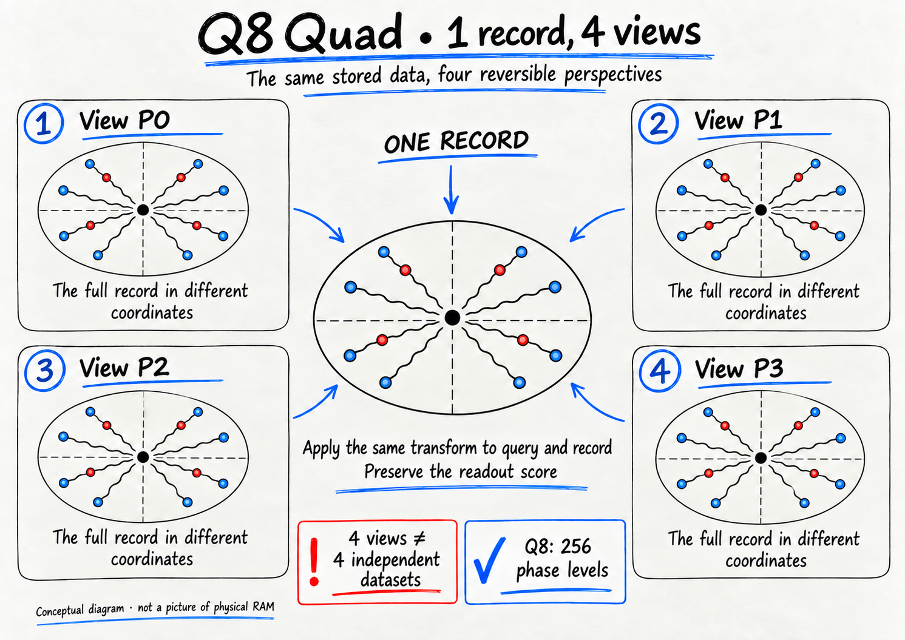
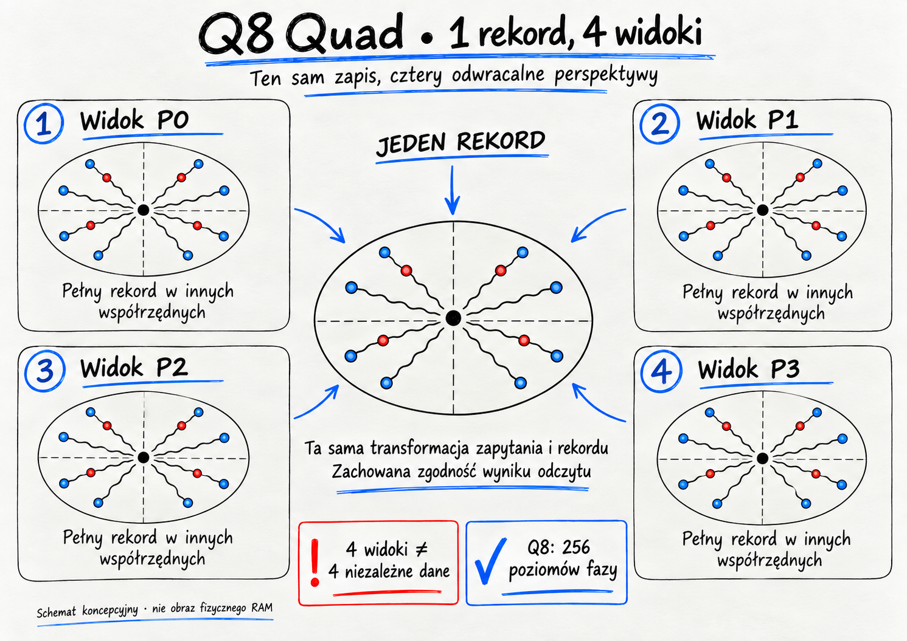
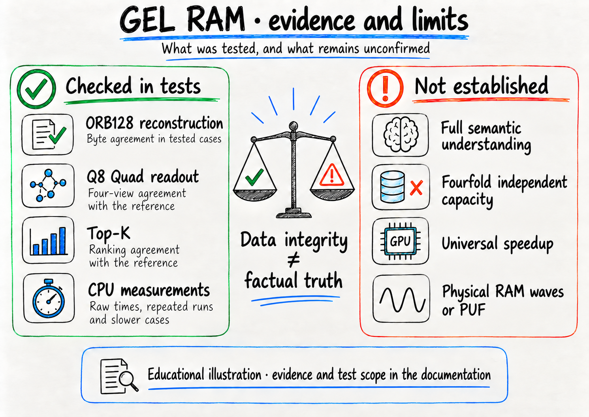
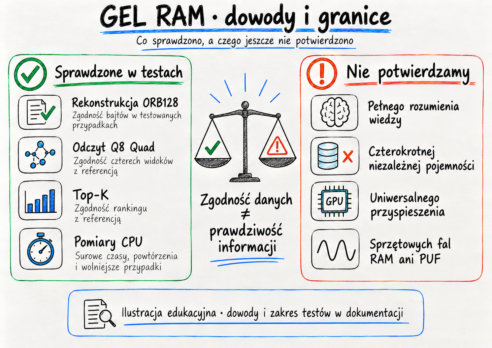

# Q8 Quad: illustrated public guide

These two illustrations, each available in English and Polish, explain the public preview. They were
edited with AI assistance from author-supplied sketches, with wording checked
against the public code and reports. They are **concept diagrams, not screenshots,
hardware measurements or evidence by themselves**. All diagrams are schematic;
dot counts, positions and colors are not a literal encoding or parity scheme.
They neither disclose nor validate the private implementation.

## One record, four views

### English — Q8

### Polski — Q8

**English text equivalent.** One stored record has four reversible coordinate
views P0–P3. Applying the matching transform to query and candidate preserves
the score under the documented policy. Each view uses the whole record, not
just its positive or negative phase components. The picture does not specify
the actual permutation or phase-offset arrays; use the code and tests.

Q8 means **256 phase levels**. The public in-memory Record holds 1024 phase
bytes and 128 activity-mask bytes: **1152 bytes**, with additional runtime
tables and buffers accounted separately. It is distinct from the binary-core
ORB128 record of 128 bytes. Four equivalent views do not store four arbitrary,
independent files in one record. Numeric exactness after quantization does not
make quantization itself lossless.

See the [Q8 contract](Q8-QUAD.md), [interactive Rust demo](PUBLIC-DEMO.md#interactive-q8)
and [binary format](FORMAT.md). The wave-shaped lines and fixed central point
are a visual metaphor, not an assertion that the CPU controls physical DRAM waves.

## Evidence and limits

### English — evidence

### Polski — dowody

**English text equivalent.** The tests check ORB128 byte reconstruction, Q8
view-score equivalence and Top-K agreement with a reference. CPU measurements
retain raw durations, repetitions and slower cases. These are not tests of full
semantic understanding, universal acceleration, fourfold independent capacity,
physical RAM waves or a hardware fingerprint. The GPU-shaped caution icon does
not represent a GPU experiment: the reported timing campaign is CPU-only.

Integrity is not truth: matching an approved source proves byte correspondence,
not that the source is factually correct. Repeated benchmarks have varying
durations, not identical times. Reference implementations and CI are not an
independent third-party scientific validation. No live web/video/P2P demo is
advertised by these two illustrations.

| Claim illustrated | Public evidence | Scope |
| --- | --- | --- |
| Binary reconstruction | [Integrity protocol](DATA-INTEGRITY.md) | Tested structural cases; separate from source truth |
| Four-view agreement | [R2 audit](Q8-CANDIDATE-R2-AUDIT.md) | Numeric equivalence on recorded datasets, not semantic accuracy |
| Top-K correctness | [Top-K benchmark](TOPK-BENCHMARK.md) | Ranking against a specified reference, not relevance labels |
| CPU timings | [Raw-derived R2 table](evidence-q8-r2/summary.txt) | Full matrix and slower cases on one shared host |
| Hardware | [Host provenance](HARDWARE.md) | 128 GB owner-reported installed; approximately 93.91 GiB OS-visible |

## Artwork provenance and release boundary

The built-in image-generation editor produced these corrected raster assets.
The original sketches remain outside the public checkout. No screenshots of
private code, source corpus, conversations or user account data were used in
the approved exports. Generator provenance metadata is retained; it is not a
GEL benchmark attestation. Visual review and release pins do not prove absence
of arbitrary steganography or vulnerabilities in downstream image decoders.

The [prompt record](VISUAL-PROMPTS.md) documents the approved wording and method.
The Rust release gate pins these four PNG paths by their reviewed SHA-256
digests, alongside the separately reviewed media screenshots and previews; any
PNG outside that reviewed list, or modified bytes, fails. Implementation remains Rust.
This is a content approval boundary, not a new multimedia decoder or private
image-to-ORB encoder. The public license is unchanged.
