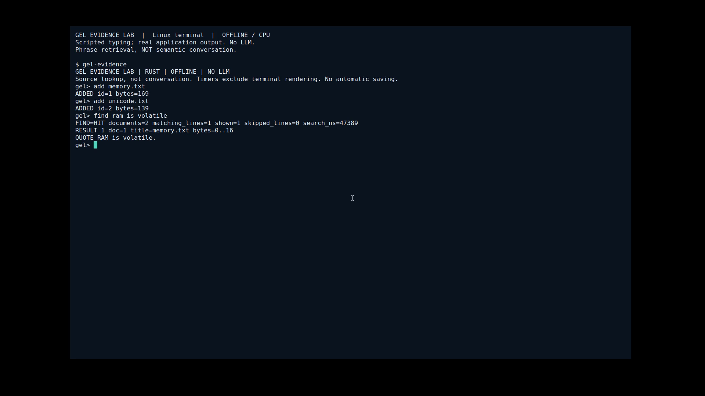
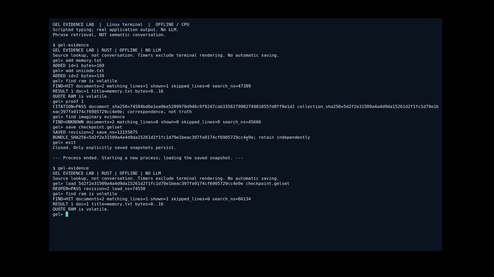

# Evidence Lab — actual offline terminal walkthrough

[Watch the 70-second English recording](GEL-EVIDENCE-LAB-EN.mp4).

This film demonstrates the **public-candidate source code**, not the private
conversational prototype shown by the two older films. It is a real xterm window
on an isolated Xvfb desktop, recorded by FFmpeg. The user's personal desktop was
not captured. Commands are scripted; every response and printed time comes from
the running gel-evidence binary. No answer replacement, time remapping, speed-up,
LLM generation or external service. The application process is restarted on camera.

## What happens

- Import two authored UTF-8 fixtures into a bounded collection.
- Find a phrase, display the original quote and validate its source hash.
- A missing phrase returns UNKNOWN, not an invented answer.
- Save a new plaintext snapshot; retain the exact pin emitted by the application.
- Exit, start a new process, load that snapshot and obtain the same citation.
- Exit waits about 1.8 seconds before Enter. The terminal is not cleared.

## Scope of the visible numbers

The two input files contain 169 and 139 bytes, not a million-record Ocean.
Observed first search: 47,389 ns; save: 12,155,075 ns; reopen: 74,550 ns;
search after reopen: 66,134 ns. These are single demonstration observations,
not a comparative benchmark or tail distribution. Timers exclude terminal
rendering and scripted typing. The capture and desktop add workload. No ORB/s,
tokens/s, semantic understanding or fourfold independent storage is claimed.

Host: Linux x86_64, Ryzen AI 9 HX 370, 24 logical CPUs available. Application
source lookup is single-threaded CPU work; no GPU inference backend. A CPU clock
display alone would not prove absence of GPU use, so it is not offered as proof.
Execution and capture used a separate network namespace, with local X11 only.

## Provenance and reproduction

- 1920×1080, H.264, 20 fps, 70.35 s, no audio, 840,031 bytes.
- MP4 SHA256: `a7b4e85d5db1274c61a49d8814908321130dad6c3eec9324de0500071d9c9835`.
- Recorded binary SHA256: `ca8949429f2322e87e2956a1bd6abd77f3a6445d70717a28cabac1555ce83fb4`.
  Binary not distributed; path/toolchain can affect rebuilt binary identity.
- Collection and terminal runtime source unchanged from local review commit
  `676e751718881705a1538fb84a6ba2dd7f103677`.
- [Commands](evidence-lab/commands.txt), raw [process 1](evidence-lab/process-1.txt)
  and [process 2](evidence-lab/process-2.txt) stdout. Commands are echoed by the
  driver, not duplicated in raw child stdout. Both sources are included as
  [fixtures](../crates/gel-source/fixtures/evidence-lab/README.md).
- [Rust typing driver](../tools/record_evidence.rs): compile with Rust 1.85.0 and
  run in a fresh directory containing those two fixtures, passing the absolute
  gel-evidence binary path. It creates a checkpoint and transcript there.
  Screen capture tools are optional and not required to run the application.

The complete video was decoded without errors; start/result/restart frames were
visually inspected. It does not prove power-loss survival, encryption or general
AI quality. Media rights remain as described in [RIGHTS.md](RIGHTS.md).
The owner authorized public branch/PR publication. Merging and a final release
remain unapproved; see [candidate status](../CANDIDATE-STATUS.md).
