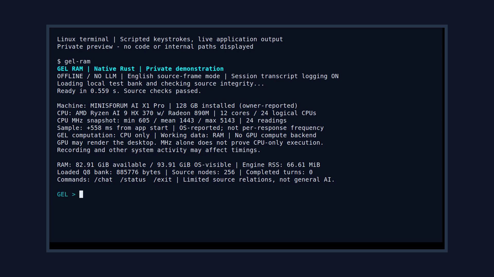
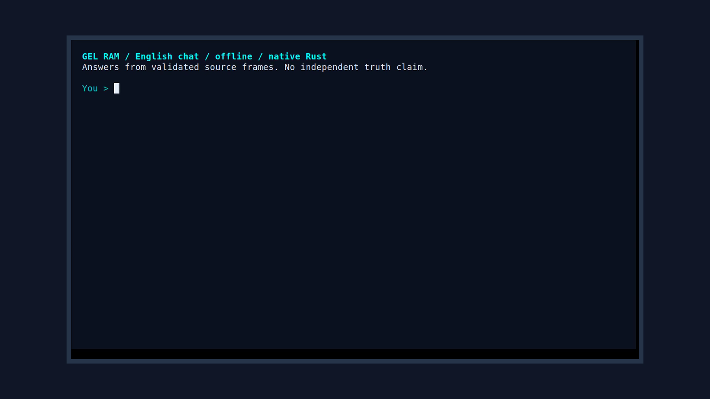
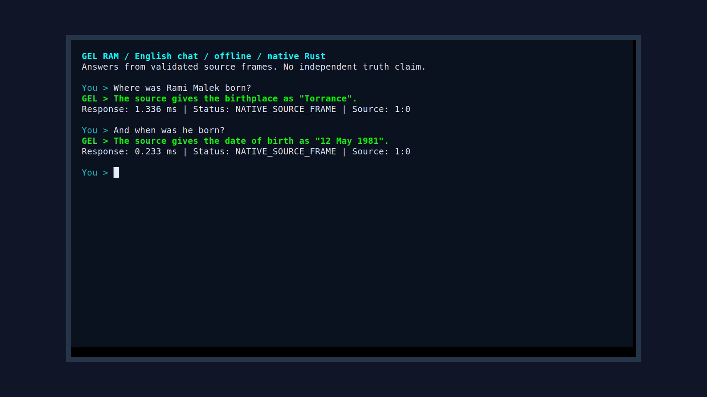
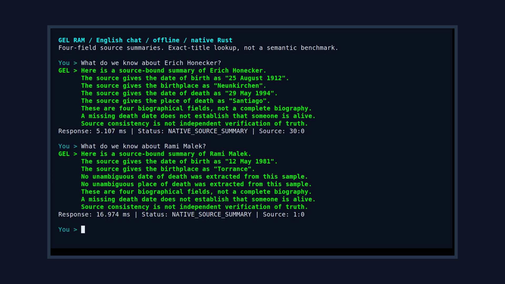
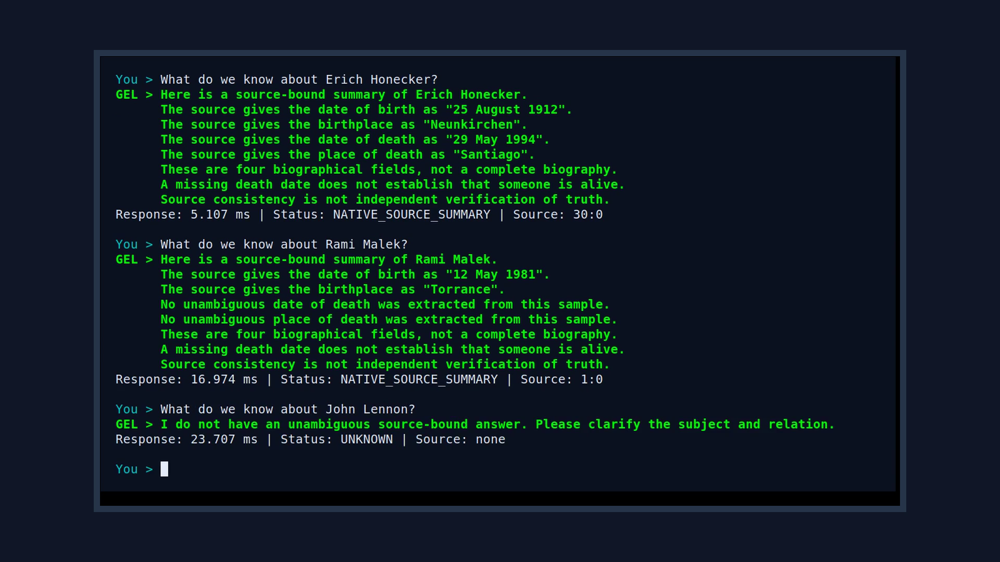

# GEL RAM — two native terminal demonstrations

These are local application previews, not videos of the public source examples.
The chat command, private bank and private implementation are **not included**
in this review bundle. The demonstrated route uses native Rust, local source
frames and bounded English templates, without an LLM or external API. It is
not a demonstration of general intelligence or unrestricted conversation.

Both films show a centered Linux terminal with scripted, labelled keystrokes
and live application responses. A neutral border frames the terminal; it is
not a recording of the owner's physical desktop. Both are silent 1920×1080,
30 fps recordings. The six PNGs below are direct decoded frames at the stated
timestamps: no text replacement, retouching or AI-generated screenshots.
Screenshots document visible output, not an independent benchmark.

## Film 1 — startup, contextual replies and a refusal

[Watch the 90-second film](GEL-RAM-HARDWARE-EN-CENTERED-90s.mp4)

The application starts with hardware and memory information, enters `/chat`,
answers a birthplace question, resolves a follow-up about the same person's
birth date, switches subject, and declines an unsupported family relation.
It ends with `/status` and `/exit`.

| English question | Displayed latency (rounded) | Observed response |
|---|---:|---|
| Where was Rami Malek born? | 1.336 ms | The source gives Torrance. |
| And when was he born? | 0.233 ms | The source gives 12 May 1981. |
| Where did Erich Honecker die? | 0.436 ms | The source gives Santiago. |
| When did his father die? | 0.140 ms | UNKNOWN; the supported relation rules cannot resolve it. |

### 00:10 — hardware information

MINISFORUM AI X1 Pro and 128 GB installed RAM are owner-reported. Linux reports
AMD Ryzen AI 9 HX 370, 12 cores / 24 logical CPUs and 93.91 GiB visible RAM.
Installed RAM is not the same quantity as OS-visible, available or process RAM.
The panel reports all of these separately; it does not establish the reason
for the installed/visible difference. The loaded bank has 256 source nodes.

### 00:25 — chat entry

The header states that replies use validated source frames and makes no
independent truth claim. In this recording `/chat` is held for about three
seconds before Enter; the subsequent empty prompt makes the transition visible.

### 00:45 — a contextual follow-up

The second question reuses the first subject. Each output includes a measured
response time, status and source anchor. This illustrates one supported
contextual relation, not arbitrary pronoun resolution.

### 01:10 — an unsupported relation remains UNKNOWN

The application does not substitute the subject's own death date for the
father's date. Keeping this failure on screen shows a boundary; a single
refusal does not prove that all unsupported questions are handled correctly.

## Film 2 — longer summaries in a continuous chat

[Watch the 60-second film](GEL-RAM-CONTINUOUS-CHAT-EN-60s.mp4)

Three prepared questions follow one another without `/clear`. Each answer
remains visible for approximately ten seconds before the next transition.
The typed `/chat` and `/exit` commands pause for about two seconds before Enter.
The recording contains no answer substitutions, cuts or speed changes.

| English question | Displayed latency (rounded) | Observed response |
|---|---:|---|
| What do we know about Erich Honecker? | 5.107 ms | Birth date/place and death date/place from source frames. |
| What do we know about Rami Malek? | 16.974 ms | Birth fields; death fields explicitly unresolved. |
| What do we know about John Lennon? | 23.707 ms | UNKNOWN: no unambiguous supported summary in this route. |

### 00:37 — two source summaries

Each successful summary contains eight sentences: an introduction, four field
results and three limitations. This is not eight independent biographical
facts. In particular, a missing death date does not establish that a person
is alive. The route uses exact-title navigation and templated wording, not
a semantic Q8 retrieval benchmark or free-form language generation.

### 00:49 — the third request exposes a limitation

John Lennon exists as a catalog subject, but this route cannot produce an
unambiguous supported summary. An earlier diagnostic expectation of success
failed; that failure remains in the local evidence. This response is not
evidence that the Ocean lacks information about the subject.

## What the measurements do and do not establish

- Reply latency covers request IPC, native processing, English realization and
  decoding. It excludes scripted typing, reading pauses and final rendering.
  The per-run figures are not a controlled comparison between the two films.
- CPU frequency is a startup snapshot, not a per-reply measurement or proof
  that the GPU is idle. The selected computation backend is native CPU;
  desktop rendering may use a GPU. RAM is working storage, not a substitute
  for the CPU executing the program.
- Both runs use a small bank: 885,776 bytes and 256 nodes. Engine RSS is about
  67 MiB. These observations do not establish full-Ocean scalability.
- No ORB/s throughput is inferred from chat latency. No token rate, semantic
  accuracy percentage, 4× independent capacity, physical DRAM-refresh coupling
  or P2P performance is established by either recording.
- The startup panel explicitly says diagnostic transcript logging is ON.
  “Volatile” at exit describes the in-memory conversation state; it does not
  mean that diagnostics never wrote text to disk. The diagnostic transcripts
  are not bundled. Neither film tests durable learning or crash recovery.
- Network isolation and native/no-LLM execution belong to the recording setup.
  A screenshot alone cannot independently certify the entire execution path.

Further run-specific details: [film 1 notes](DEMO.md) and
[film 2 notes](DEMO-CONTINUOUS-CHAT.md).
See [remaining release gates](../CANDIDATE-STATUS.md) before redistribution.
