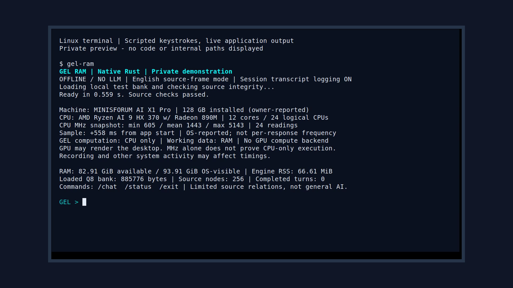
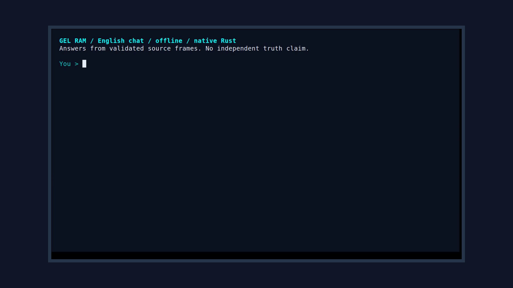
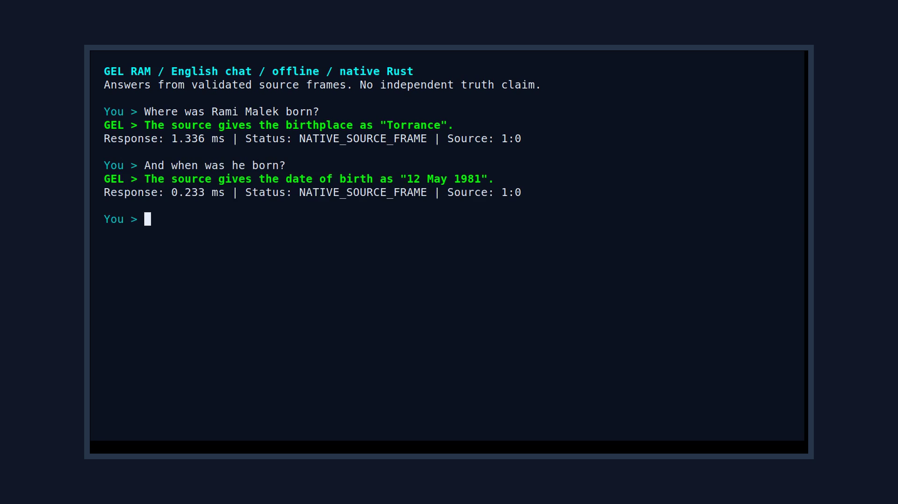
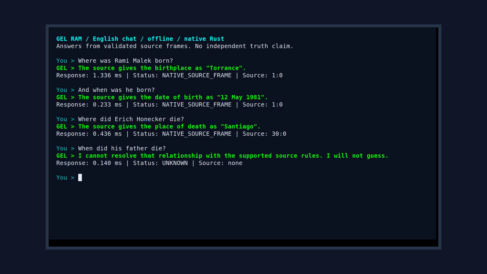
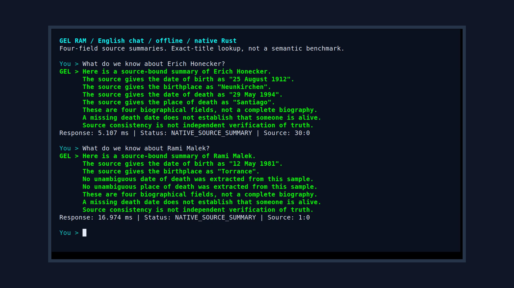
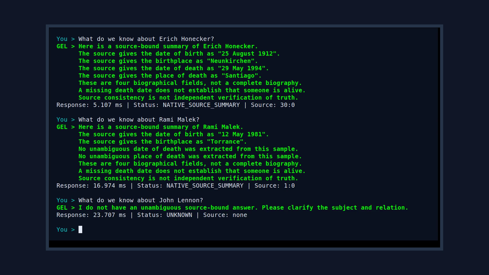

# GEL RAM — two private application previews

These two films, recorded on 13 September 2026, preview a separate private
native Rust application. They are not videos of the public source examples,
and the application, its engine, bank, logs and recording scripts are not in
this repository. The public [Evidence Lab walkthrough](EVIDENCE-LAB-GUIDE.md) is
the film you can reproduce from this checkout; start there. All films are
listed in the [film index](INDEX.md).

Both are silent 1920×1080, 30 fps recordings of a centered Linux terminal
inside a neutral border, not the owner's physical desktop. Keystrokes are
scripted and labelled; responses and timings are produced live by the
application. There are no cuts, answer substitutions or speed changes. The six
PNGs below are direct decoded frames at the stated times, without retouching.

## Film 1 — 90 s: startup, a follow-up and a refusal

[Watch the 90-second film](GEL-RAM-HARDWARE-EN-CENTERED-90s.mp4)

The application shows hardware and memory information, enters `/chat`,
answers a question, answers a follow-up about the same subject, changes
subject, answers UNKNOWN to an unsupported question, then shows its status and
exits.

## Film 2 — 60 s: three questions in one session

[Watch the 60-second film](GEL-RAM-CONTINUOUS-CHAT-EN-60s.mp4)

Three questions follow one another without clearing the screen. Two receive
source-based summaries; the third is answered UNKNOWN.

## What the films do not establish

- Nothing in them can be reproduced from this repository.
- Displayed times are single on-screen values from one run of each film,
  measured by the application. They are not a benchmark, a throughput figure
  or a controlled comparison between the two films.
- The answers are bounded and source-based, not produced by an unrestricted
  language model. Consistency with a source is not independent verification of
  truth. A value the source does not give is not evidence of its absence, and
  UNKNOWN does not mean the data holds nothing about the subject.
- One follow-up does not show general context handling, and one refusal does
  not show that every unsupported question is refused.
- No general understanding or reasoning, persistent learning, network
  operation, hardware-level memory computation, semantic accuracy, token rate
  or ORB/s is established.
- The machine is owner-reported as a MINISFORUM AI X1 Pro with 128 GB of
  installed RAM; Linux reported an AMD Ryzen AI 9 HX 370 with 93.91 GiB of
  visible RAM. Installed, visible and process memory are different quantities.
  CPU readings on screen are momentary snapshots, not proof that the GPU was
  idle.
- The private-preview label is on screen only before `/chat` clears it
  (0–24.5 s in film 1, 0–15.7 s in film 2); everything after it is still the
  private application, not the public checkout.
- The startup panel shows that session logging to disk was on; “Volatile” at
  exit refers to the in-memory conversation state. Neither film tests durable
  learning or crash recovery.
- The no-network, no-LLM setup belongs to the recording environment; a
  screenshot cannot certify the execution path.

See [media rights](RIGHTS.md) and the
[remaining release gates](../CANDIDATE-STATUS.md) before redistribution.
